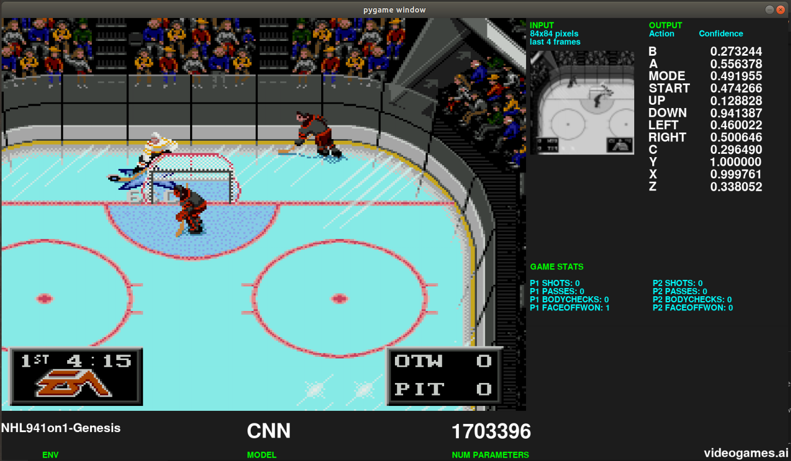

# nhl94-ai


The end goals of this project is to:
*   Train Models that play NHL 94
*   Support AI vs AI contests in NHL 94
*   Provide an improved AI opponent for NHL 94 players



## Installation

Requires:
*   Tensorflow 1.X, 1.14 recommended
*   stable-baselines 2.10 (fork of baselines)
*   stable-retro (fork of gym-retro)

```
sudo apt-get update
sudo apt-get install cmake python3 python3-pip git zlib1g-dev libopenmpi-dev ffmpeg
```

```
pip3 install opencv-python anyrl gym joblib atari-py tensorflow-gpu==1.14 baselines stable-baselines pygame

pip3 install git+https://github.com/MatPoliquin/stable-retro.git
```

## Install roms
You need to provide your own NHL 94 - Sega Genesis rom

In your rom directory exec this command, it will import the roms into stable-retro
```
python3 -m retro.import .
```

Currently there is two NHL 94 env in stable-retro: The original game and the '1 on 1' rom hack which as the name implies is for 1 on 1 matches instead of full teams

## Examples

Train your model:
```
python3 model_trainer.py --env=NHL941on1-Genesis --state=canadiensvsnordique.haspuck --num_timesteps=6000000
```

Note: By default the your model will be in the OUTPUT folder in your home directory. Can be customized with --output_basedir


Test your model:
```
python3 model_vs_game.py --env=NHL941on1-Genesis --state=PenguinsVsSenators.haspuck --load_p1_model=./models/canttouchthis-6m
```

Pit two models against each together:
```
python3 model_vs_model.py --env=NHL941on1-Genesis --state=PenguinsVsSenators.2P --load_p1_model=[PATH TO P1 MODEL] --load_p2_model=[PATH TO P2 MODEL]
```
