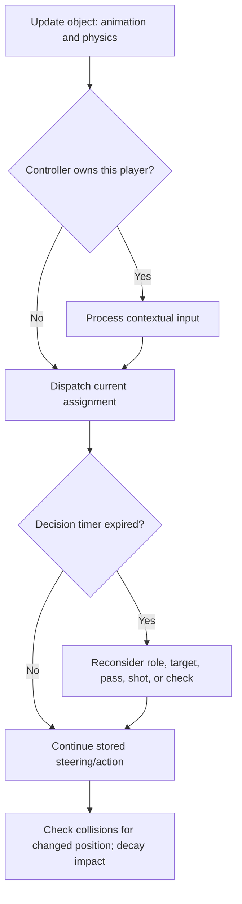

# NHL ’94 Deep Dive

An implementation-level guide to the **Genesis version**: CPU AI, skater and goalie attributes, controls, shot aiming, passing, collisions, and the local Stable Retro integration.

Prepared 2026-09-25 from this repository and `/home/mat/github/stable-retro/stable_retro/data/stable/NHL94-Genesis-v0`.

Goalie expansion, 2026-09-25: sections 9.8–9.15 add positioning/turning rules, ROM animation timing, collision-path distinctions, retrieval/cover transitions, manual control, pulling, special modes, and a precise list of remaining validation work.

## Scope and evidence

The two local ROMs are **byte-for-byte identical**:

| Item | Verified value |
|---|---|
| Disassembly ROM | `nhl94.bin` |
| Stable Retro ROM | `NHL94-Genesis-v0/rom.md` — a binary ROM, despite its extension |
| Size of each | 1,048,576 bytes |
| SHA-1 of each | `7b1489ab501258133bf03e5f0892b77d04312580` |
| Integration’s expected SHA-1 | Same value in `rom.sha` |
| Disassembly repository revision | `b53cbd01245473325c12a7eeb13889bab33cedfe` |

This matters: the findings below are about the ROM actually present in the supplied integration, rather than a different platform or a community ROM with gameplay fixes.

The primary evidence is [nhl94.bin.lst](/home/mat/github/nhl94-disassembly/nhl94.bin.lst), with [RAM symbols](/home/mat/github/nhl94-disassembly/src/ram_addrs.inc) and the integration files. The repository explains that its annotations were developed using the older NHL Hockey source. Some inherited comments, function names, and guesses are inaccurate. Instructions and their consumers take precedence over comments.

**Evidence conventions:**

- **Confirmed in code:** a direct instruction, table, or branch in the inspected listing.
- **Derived:** a formula or gameplay implication obtained by following those instructions.
- **Unresolved:** a claim that needs additional tracing or controlled emulator experiments.

This is a static code and file audit. No gameplay trial or statistical save-rate experiment was run. Equations below describe the relevant path, with important integer-width effects called out; they are not a complete emulator. The original [EA Genesis manual](https://www.nhl94.com/multimedia/manuals/NHL94_GEN.pdf) provides a secondary check on the intended controls, especially printed pages 3–6 and 29–30. Runtime details come from the local code.

## Contents

1. [The overall model](#1-the-overall-model)
2. [Coordinates, timing, memory, and flags](#2-coordinates-timing-memory-and-flags)
3. [Player controls and input timing](#3-player-controls-and-input-timing)
4. [Shooting and D-pad aiming](#4-shooting-and-d-pad-aiming)
5. [Passing, receiving, and puck possession](#5-passing-receiving-and-puck-possession)
6. [How the CPU skater AI works](#6-how-the-cpu-skater-ai-works)
7. [How player attributes become gameplay values](#7-how-player-attributes-become-gameplay-values)
8. [Skating, fatigue, checking, and the weight bug](#8-skating-fatigue-checking-and-the-weight-bug)
9. [Goalie AI, attributes, and saves](#9-goalie-ai-attributes-and-saves)
10. [Team bonuses and situational behavior](#10-team-bonuses-and-situational-behavior)
11. [Physics, goals, faceoffs, and recorded statistics](#11-physics-goals-faceoffs-and-recorded-statistics)
12. [Stable Retro integration audit](#12-stable-retro-integration-audit)
13. [Practical implications and experiments](#13-practical-implications-and-experiments)
14. [Source map and remaining uncertainties](#14-source-map-and-remaining-uncertainties)

## 1. The overall model

NHL ’94 uses **handwritten, stateful rules**. Players have assignments, timers, destinations, velocities, animation state, and attributes. Those assignments choose among skating, supporting, pursuing, passing, shooting, checking, returning to the bench, and other actions.

There is no learned policy in the traced gameplay system. The CPU reads game state directly: puck position and velocity, possession, other players, team membership, attack direction, animation flags, and tactical conditions. It does not infer the rink from the rendered image.

Three interacting systems explain much of the game:

1. **Decision rules** select a destination or action.
2. **Movement and animation** determine whether and when that action can occur.
3. **Collision and puck physics** determine possession, rebounds, checks, and goals.

Attributes affect different parts of this chain. Speed controls an acceleration acceptance limit. Agility and weight affect acceleration. Awareness controls decision delays. Shooting accuracy changes launch error. Stick handling affects both possession and some knockdown outcomes. Goalie agility changes collision reach as well as movement.

Important findings that recur throughout this document:

- A normal C-button shot selects a target **inside the goal mouth**. The D-pad does not simply launch the puck along the skating direction.
- **UP raises the shot; DOWN selects a low shot**, including when attacking the bottom goal in normal vertical-rink play.
- A one-timer goes through automatic shot aiming even for a human-controlled receiver.
- Higher awareness usually means a **smaller stored decision-delay value**.
- Several offensive support assignments actually read the **defensive** awareness delay.
- Human-controlled burst checks have a **byte-overflow weight bug**. Merely reversing the sign of a weight difference is not an adequate explanation.
- Some goalie quadrant-rating calculations are present but their results are discarded before the actual catch/rebound decision.
- Stable Retro’s observations contain several naming/address/type problems. Correcting the interpretation is essential before drawing conclusions from agent behavior.

Sources: [game loop](/home/mat/github/nhl94-disassembly/nhl94.bin.lst:29914), [player update](/home/mat/github/nhl94-disassembly/nhl94.bin.lst:35328), [assignment table](/home/mat/github/nhl94-disassembly/nhl94.bin.lst:56677).

## 2. Coordinates, timing, memory, and flags

### 2.1 Rink coordinates

Normal rink coordinates are centered around `(0, 0)`:

| Quantity | Meaning/value used in the code |
|---|---|
| Positive X | Right on the normal rink view |
| Positive Y | Toward the top of the rink |
| Negative Y | Toward the bottom |
| Z | Height above the ice |
| Goal lines | `Y = ±264` (`±0x108`) |
| Blue lines | `Y = ±88` (`±0x58`) in the main tactical tests |
| Side-board reference | `X = ±136` (`±0x88`) in puck projection |
| End-board aiming reference | `Y = ±296` in shot-animation preparation |

These are engine coordinates, not the pixel coordinates of a cropped camera image. Goal-mouth targets and collision limits also differ slightly: do not treat every constant near a goal as the same boundary.

For tactical analysis, use the player’s attack-direction flag:

```python
attack_sign = +1 if (pflags & 0x80) else -1
attack_y = attack_sign * world_y
```

Positive `attack_y` is the offensive half. A fixed rule such as “positive Y is always my offensive end” fails when ends change. Keep **tactical coordinate normalization** separate from **shot-height input**: UP is still the high-shot command.

Sources: [shot setup](/home/mat/github/nhl94-disassembly/nhl94.bin.lst:37409), [goal-line projection](/home/mat/github/nhl94-disassembly/nhl94.bin.lst:42892), [slot detection](/home/mat/github/nhl94-disassembly/nhl94.bin.lst:963065).

### 2.2 Object structure

The principal object array starts at bus address `0xFFB04A`. Each record is `0x80` bytes:

```text
object_address = 0xFFB04A + 0x80 * SCnum
```

The listing often writes the equivalent sign-extended address `0xFFFFB04A`. The Genesis bus address is the lower 24 bits.

| SCnum | Meaning |
|---|---|
| 0–5 | Home-team on-ice slots |
| 6–11 | Away-team on-ice slots |
| 12–13 | Additional rink objects, including the nets |
| 14 | Puck: `0xFFB74A` |
| 15 | Puck shadow object |

An **on-ice slot is not a roster identity or controller identity**. The roster index is stored inside the slot. Substitutions can change the player occupying it. Goalies are found by testing the position field, rather than assuming a permanent slot.

Useful offsets from a player record:

| Offset | Size | Meaning |
|---|---|---|
| `+0x00` | 32-bit | X position; upper signed word is integer X |
| `+0x06` | 16-bit | Displayed sprite frame |
| `+0x14` | 32-bit | Y position; upper signed word is integer Y |
| `+0x18` | 32-bit | Z position |
| `+0x1C/+0x20/+0x24` | 32-bit each | Previous X/Y/Z |
| `+0x28/+0x2A/+0x2C` | Signed 16-bit each | X/Y/Z velocity |
| `+0x2E` | 16-bit | Last-impact object reference |
| `+0x30/+0x32` | 16-bit each | Previous/current impact state |
| `+0x34` | Signed 16-bit | Position; 0 is goalie, negative is inactive/off ice |
| `+0x36` | 16-bit | Current index into assignment list |
| `+0x38…+0x3F` | Eight bytes | Assignment list |
| `+0x40…+0x49` | Mixed | Assignment-specific timers, targets, and scratch values |
| `+0x4A/+0x4C` | 16-bit each | Wall-collision X/Y radii; not assignment scratch |
| `+0x4E/+0x50` | 16-bit each | Last wall-contact cosine/sine |
| `+0x52` | 16-bit | SCnum |
| `+0x54` | 16-bit | Facing direction, with additional fractional turning state following it |
| `+0x58` | 16-bit | Animation identifier/offset |
| `+0x5A` | 16-bit | Index into animation data |
| `+0x5C` | 16-bit | Animation countdown |
| `+0x5E/+0x5F` | Byte each | Puck-contact-related cooldowns |
| `+0x62/+0x63/+0x64` | Byte each | Three separate player flag bytes |
| `+0x65` | Byte | Minimum sprite-frame-change timer |
| `+0x66` | Byte | Player’s roster index |
| `+0x67…+0x76` | Mostly bytes | Weight, effective attributes, jersey, handedness |

Position codes used by the tactical assignments include 1/2 for defense, 3/5 for wings, and 4 for center. The code also supports a replacement forward position when appropriate.

Collision detection also depends on `Ylist` (`0xFFB84A`, 16 signed words),
`OOlistpos` (`0xFFB86A`, 16 inverse-index words), and `OOlist` (`0xFFB88A`,
16 bytes containing **twice** each object slot). `SprSort` orders these by Y in
vertical view, or X in horizontal view. Repositioning objects must rebuild all
three tables: `checkplcoll` uses cached coordinates to select collisions but
current coordinates to calculate impulses, so stale entries can generate
nonphysical launches. Preserve each object's collision radii when resetting AI.

Sources: [updateplayers](/home/mat/github/nhl94-disassembly/nhl94.bin.lst:35328), [setplayer](/home/mat/github/nhl94-disassembly/nhl94.bin.lst:51562), [goalie lookup](/home/mat/github/nhl94-disassembly/nhl94.bin.lst:36507).
See also [collision candidates and impulses](/home/mat/github/nhl94-disassembly/nhl94.bin.lst:48576),
[default collision radii](/home/mat/github/nhl94-disassembly/nhl94.bin.lst:53436),
and [SprSort](/home/mat/github/nhl94-disassembly/nhl94.bin.lst:53618).

### 2.3 Flags: an important 68000 detail

In `btst #3,(sflags).w`, the `.w` specifies the **absolute-short address form**. A bit operation on memory tests a **byte**, not a 16-bit flag word.

Therefore, when a Retro field reads two bytes as big-endian `>u2`, a bit in the byte at the starting address appears in the **upper half** of the returned number:

```python
# ROM: btst #3,(sflags).w
shot_aiming = bool(sflags_u16 & 0x0800)

# ROM: btst #1,(word_FFC2F8).w
one_timer_shot = bool(word_ffc2f8_u16 & 0x0200)
```

Do not apply `1 << 3` directly to a two-byte observation without checking which byte the instruction accesses.

Useful player-byte masks:

| Byte | Bit/mask | Observed role |
|---|---|---|
| `+0x62` | 0 / `0x01` | Reduced deceleration mode, used during pass reception |
| `+0x62` | 1 / `0x02` | New assignment needs initialization |
| `+0x62` | 3 / `0x08` | Joystick controlled |
| `+0x62` | 4 / `0x10` | Backward skating |
| `+0x62` | 5 / `0x20` | Animation lock |
| `+0x62` | 6 / `0x40` | Away team when set |
| `+0x62` | 7 / `0x80` | Attacking top goal when set |
| `+0x63` | 1 / `0x02` | Animation in progress |
| `+0x63` | 2 / `0x04` | Unavailable for several selection/contact paths |
| `+0x64` | 0 / `0x01` | Player offside state in relevant paths |
| `+0x64` | 1 / `0x02` | Breakaway state |
| `+0x64` | 3 / `0x08` | One-timer state |
| `+0x64` | 4 / `0x10` | Wall collision state used during checking |
| `+0x64` | 5 / `0x20` | Falling state |

The integration’s `*_state_flags` fields read only **`+0x64`**. They do not include the joystick-control or animation-lock bits at `+0x62`.

### 2.4 Frames, game-clock seconds, and animation indices are different

`DoGameFrame` sets `d7` to the number of vertical blanks since its previous update. Movement and many countdowns scale by `d7`. Some branches instead count routine calls or inspect the video hardware counter.

The regular clock interrupt subtracts `0x0AAA` from a fractional counter. A borrow subtracts one displayed game-clock second. That is approximately **24 vertical blanks per displayed second**, rather than 60. A displayed five-minute period is consequently much shorter than five wall-clock minutes at normal NTSC timing.

An animation index is different again: `updateanim` advances `+0x5A` by **4**, stepping through frame/duration entries. A shot release threshold of `0x1C` is an animation-data index, **not a promise that the shot takes 28 emulator frames**.

Sources: [DoGameFrame](/home/mat/github/nhl94-disassembly/nhl94.bin.lst:29914), [clock interrupt](/home/mat/github/nhl94-disassembly/nhl94.bin.lst:51784), [updateanim](/home/mat/github/nhl94-disassembly/nhl94.bin.lst:35702).

### 2.5 Randomness

`randomd0(N)` returns an integer in `[0, N)`. `randomd0s(N)` calls it with `2N` and subtracts `N`, giving `[-N, N)`; the negative endpoint is included despite the older comment’s wording.

The seed is at `0xFFD066`. The arithmetic implements a 32-bit recurrence with multiplier `0xBB40E62D` and increment 1, then scales selected bits to the requested range. Some decisions separately use `VDP_CNTR` or frame-counter bits. Reproducing the same match requires the same complete emulator state and input timing, not merely the same displayed positions or ratings.

Source: [randomd0/randomd0s](/home/mat/github/nhl94-disassembly/nhl94.bin.lst:44175).

## 3. Player controls and input timing

### 3.1 Context changes the meaning of the buttons

| Situation | A | B | C | D-pad |
|---|---|---|---|---|
| Skater with puck | Flip/clear; line-change behavior depends on settings/context | Pass | Start shot; holding extends windup | Skate, or select pass/shot direction during the corresponding mode |
| Skater without puck | Hold/hook | Switch/poke-check behavior; hold for manual goalie control when enabled | Burst/check, or eligible one-timer | Skate |
| Goalie without puck, manually controlled | Dive with a direction | Control switching | Save attempt | Move goalie |
| Goalie with puck | Clear | Pass | Not the ordinary skater shot path | Move/aim pass |
| Faceoff participant | Context-dependent line selection before play | Start faceoff sweep | Context-dependent; burst once normal play resumes | Store draw direction |
| Menus/line-choice overlay | Menu-specific | Menu-specific | Menu-specific | Select option |

START enters the pause/scoreboard flow. The broad controls agree with the [original manual, printed pages 3–6](https://www.nhl94.com/multimedia/manuals/NHL94_GEN.pdf). The branching details below come from [doinput](/home/mat/github/nhl94-disassembly/nhl94.bin.lst:35884) and its continuation through `loc_B81A`.

### 3.2 A press, a hold, and a release are separate signals

`ReadJoy1`/`ReadJoy2` provide:

```text
d0: decoded D-pad direction, plus button information
d1: newly pressed buttons
d2: buttons whose state changed
d3: currently held buttons
```

The relevant decoded button bits are B=4, C=5, A=6, START=7. These are **ROM input bits**, not indices in a Retro action vector.

Consequences:

- Holding C continuously does not repeatedly produce new C presses.
- A release can be the event that finishes a windup or resolves a pass/control-selection action.
- A C press without possession can trigger a burst instead of a shot.
- Animation locks can prevent a requested action from taking effect.
- Combining B and C can enter special control logic; the buttons are not independent abstract actions.

For automation, represent a shot or pass as a short stateful sequence with explicit press/release transitions. Observe possession and animation between steps.

Source: [ReadJoy](/home/mat/github/nhl94-disassembly/nhl94.bin.lst:44504).

### 3.3 Movement and facing

Direction codes are:

```text
7  0  1       up-left   up   up-right
6  8  2       left    neutral   right
5  4  3       down-left down down-right
```

An internal direction 9 requests stopping in steering routines; the ordinary pad decoder does not emit it. Invalid opposing direction combinations map to neutral in `jdtab`.

The D-pad requests movement, but velocity has inertia. Facing turns over time, with speed-dependent turning behavior. Releasing the pad normally allows gliding/deceleration. CPU steering can explicitly request the stop path. The game can also enter backward skating while retreating in the defensive half and facing the puck.

A burst accelerates in the **current facing direction**. A last-instant pad change is not proof that a burst/check will travel in the newly requested direction.

Sources: [jdtab](/home/mat/github/nhl94-disassembly/nhl94.bin.lst:44579), [doplayeracc](/home/mat/github/nhl94-disassembly/nhl94.bin.lst:43330), [burst](/home/mat/github/nhl94-disassembly/nhl94.bin.lst:36828).

### 3.4 Switching players and selecting the goalie

`chgplayer` searches the controller’s team for an eligible skater near a **slightly projected puck position**. It excludes goalies in that ordinary search, unavailable players, other controlled players, and locked candidates where tested. It does not cycle blindly through jersey numbers.

The current skater is **included** in that search. If that skater wins, B runs
`Sweepcheck` rather than selecting the next-closest teammate. The puck projection
adds each signed velocity word shifted right by eight bits to its coordinate;
ties favor the later slot in the scan. Eligibility uses object byte `+0x62`
(control bit 3, animation-lock bit 5) and `+0x63` (unavailable bit 2), not the
legacy integration's `state_flags` field at `+0x64`.
The ordinary change-player path runs on B **release** after a short press, so
submitted input must be followed by actual controller-slot feedback.
Source: [chgplayer](/home/mat/github/nhl94-disassembly/nhl94.bin.lst:976629)
and the `doinput` release branch at disassembly lines 36109–36147.

Holding B uses a separate countdown, initialized to `0x11`, to reach the manual-goalie selection path. That countdown is decremented by input-processing calls in the relevant branch, so it should not be described as an exact real-time interval under every frame-skipping setup. The code finds the goalie by position and checks whether another controller owns him.

The signed controller-slot words can be negative when no player is selected.
`setchgplayer` writes `0xFFFF` before selecting again; other reset paths use
`st (c1playernum).w`, which sets only the high byte and can leave an `0xFFxx`
sentinel. The ROM checks the sign rather than treating these as roster indices.
Decode this as no selection, not as a goalie or a Python negative array index.
Sources: `setchgplayer` at disassembly line 42368 and controller reset paths
at lines 29864 and 53103.

Once selected, a manually controlled goalie has movement restrictions and save/dive animation handling. Manual goalie mode also has off-screen fallback behavior; the setting alone does not mean the human supplies every goalie movement throughout a play.

Sources: [B-button handling](/home/mat/github/nhl94-disassembly/nhl94.bin.lst:36036), [chgplayer](/home/mat/github/nhl94-disassembly/nhl94.bin.lst:976629), [assgoaliectrl](/home/mat/github/nhl94-disassembly/nhl94.bin.lst:38961).

## 4. Shooting and D-pad aiming

### 4.1 The actual aiming table

For an ordinary human-controlled C shot, the pad selects an `(X, Z)` target. Y is the opponent’s goal line. The ROM’s `shotsets` table is:

| Pad | `passdir` | Target X | Target height Z | Meaning |
|---|---:|---:|---:|---|
| UP | 0 | 0 | 12 | High center |
| UP+RIGHT | 1 | +16 | 12 | High right |
| RIGHT | 2 | +16 | 6 | Middle right |
| DOWN+RIGHT | 3 | +16 | 0 | Low right |
| DOWN | 4 | 0 | 0 | Low center |
| DOWN+LEFT | 5 | −16 | 0 | Low left |
| LEFT | 6 | −16 | 6 | Middle left |
| UP+LEFT | 7 | −16 | 12 | High left |
| No direction selected | 8 | 0 | 6 | Middle center |

Visualized as a target in the goal mouth:

```text
                LEFT          CENTER          RIGHT
 Z = 12         UP+LEFT          UP            UP+RIGHT
 Z =  6         LEFT            neutral        RIGHT
 Z =  0         DOWN+LEFT        DOWN          DOWN+RIGHT
                X=-16           X=0           X=+16
```

**The vertical pad choice means shot height, not “toward or away from the opposing net.”** `doshot` flips the goal-line Y for the attacking end but does not invert this human shot-height table. In normal vertical play, use UP for a high shot even while attacking down the screen. Left and right remain world/screen X choices.

This is independently consistent with the manual’s scoring instructions. Special horizontal display modes have direction-remapping code, so the table above is specifically for ordinary vertical-rink gameplay.

Sources: [shotsets](/home/mat/github/nhl94-disassembly/nhl94.bin.lst:37695), [doshot target construction](/home/mat/github/nhl94-disassembly/nhl94.bin.lst:37571), [manual, printed page 29](https://www.nhl94.com/multimedia/manuals/NHL94_GEN.pdf).

### 4.2 When aim is sampled

`SetShotMode` starts with `passdir = 8` and enables shot-direction mode. `ShotMode` updates `passdir` when it sees a non-neutral direction while the shot animation is in progress.

Two subtleties matter:

1. **Aim is latched.** Returning the pad to neutral does not overwrite an already selected aim with 8. If you aimed right and then released the pad during that shot, right remains selected.
2. **Release processing comes first at the contact threshold.** If the animation index has already reached `0x1C`, `ShotMode` branches to `prepshot` before reading a new aim. A pad change arriving only on that update can be too late.

Practical sequence:

```text
confirm possession
press C
hold the desired aiming direction during windup
release C early for a quicker shot, or hold for a longer windup
keep the aim stable until puck release is observed
```

If you want the center-middle default, avoid supplying a non-neutral direction during the aiming phase. Do not assume a long action repeat of “skate diagonally + C” will produce an unmodified center shot.

Sources: [SetShotMode](/home/mat/github/nhl94-disassembly/nhl94.bin.lst:37409), [ShotMode](/home/mat/github/nhl94-disassembly/nhl94.bin.lst:37442).

### 4.3 Wrist shot, slap shot, and backhand

The shot starts with a windup accumulator, `passspeed = 15`. Before animation index `0x10`, `ShotMode` adds elapsed frames to it. Releasing C can switch the animation into its forward swing. A lower shot-power attribute also forces that transition after an earlier animation-index threshold: the branch tests effective power against 20 and animation index against 8.

Thus wrist/slap behavior emerges from **windup duration and animation**, rather than two independent shoot buttons. Holding longer helps only while the charging portion is active.

`Findhittype` selects forehand or backhand from shot direction, facing, and sprite/hand state. An ordinary backhand reduces the windup accumulator by approximately one quarter before power scaling:

```text
windup_backhand = windup − floor(windup / 4)
```

The shooter must still possess the puck when `doshot` reaches the possession check, unless the special one-timer flag is active. Losing it during the swing can produce a whiff.

Sources: [Findhittype](/home/mat/github/nhl94-disassembly/nhl94.bin.lst:37392), [ShotMode](/home/mat/github/nhl94-disassembly/nhl94.bin.lst:37442), [doshot](/home/mat/github/nhl94-disassembly/nhl94.bin.lst:37512).

### 4.4 Shot power calculation

Let `P` be effective shot power, `E` the energy value, and `W` the windup accumulator after the applicable adjustments. Full energy is `4096` (`0x1000`). For the normal positive ranges:

```text
energy_power = floor(floor(P / 2) * E / 4096)
S = floor((20 + energy_power) * W * 21065 / 65536)
```

`21065 = 0x5249`. `S` is stored in `passspeed` and used to construct puck velocity.

The important effects are multiplicative: stronger power, more usable windup, and more energy produce a faster shot. There is also a baseline 20, so zero power does not mean zero puck velocity.

An easily misread detail: the following odd-power test adds `S/16` to register `d0`, but **does not store it back into `passspeed`**. On this path that adjusted register feeds sound selection. Do not silently add an odd-rating speed interpolation to the launch formula just because similar interpolation exists in the skating code.

For horizontal direction, the code uses the vector from the **puck’s current location** to the selected goal-mouth target:

```text
dx = target_x − puck_x
dy = target_goal_y − puck_y
D  = max(1, integer_sqrt(dx² + dy²))

puck_vx ≈ 68 * S * adjusted_dx / D
puck_vy ≈ 68 * S * adjusted_dy / D
```

The adjusted differences include shot error when applicable. The actual instructions use integer products, divisions, and word writes, and include a Y-velocity sign/overflow guard. These expressions explain the ordinary path, not arbitrary hacked values.

Source: [doshot power and launch arithmetic](/home/mat/github/nhl94-disassembly/nhl94.bin.lst:37546).

### 4.5 Shot accuracy: a perfect branch, then spatial error

Accuracy is not simply a fixed percentage chance to score.

At target distance `D ≤ 200`, the normal accuracy branch rolls:

```text
r = random(16 + effective_shot_accuracy)
perfect if r > 14
```

Assuming the RNG outcomes are approximately uniform, the conditional perfect-aim probability is:

```text
(accuracy + 1) / (accuracy + 16)
```

Examples: accuracy 0 → 1/16; 15 → 16/31; 30 → 31/46. This is the chance to skip this launch-error calculation, **not a scoring probability**. The goalie, posts, traffic, and puck trajectory still matter.

If the shot is not perfect, the ordinary-range arithmetic constructs an error range roughly as follows:

```text
base = floor(S / 16) − floor(accuracy / 2) + 16
error = floor(base * D / 64)
if D <= 250:
    error = floor(error / 2)
error = min(error, 136)
```

The implementation then adds signed random X and Y error and nonnegative Z error. Y error is capped at 60, and its range is additionally halved when the original Y difference is negative. This is a directional asymmetry in the arithmetic.

Therefore:

- Distance increases error.
- Faster shots can increase error.
- Better accuracy reduces error and increases access to the perfect branch.
- A nominally low shot can receive positive height error.
- An aimed corner is a target, not a guaranteed crossing point.

Highlight mode bypasses error. Within the distance-gated section, shootout mode and the **shooting team having its own goalie pulled** also reach the perfect branch. `ReadGoaliePulled` selects the shooter’s team; it does not mean “the opposing net is empty.”

Sources: [accuracy branch](/home/mat/github/nhl94-disassembly/nhl94.bin.lst:37592), [ReadGoaliePulled](/home/mat/github/nhl94-disassembly/nhl94.bin.lst:975232), [RNG bounds](/home/mat/github/nhl94-disassembly/nhl94.bin.lst:44175).

### 4.6 Height and the special close-range high shot

For a nonzero requested height, `doshot` computes vertical velocity using both the height target and a travel-distance/gravity compensation term, normally capped at `0x1800`. A zero height term skips this vertical-velocity assignment; it is not an unconditional `puckvz = 0` instruction.

`prepshot` has a special close-range branch when:

- The opponent has no goalie, or the goalie is in one of two pad-stack animations.
- Aim is one of 0, 1, or 7: the high-shot row.
- Attack-relative puck Y is at least 216 (`0xD8`).

It marks a flag allowing `puckvzadj` to reshape vertical velocity so the puck can float over the close obstacle. The later call excludes one-timers. This is a specific exception, not a universal “close shot always goes top shelf” rule.

Sources: [prepshot](/home/mat/github/nhl94-disassembly/nhl94.bin.lst:37471), [vertical launch](/home/mat/github/nhl94-disassembly/nhl94.bin.lst:37665), [puckvzadj](/home/mat/github/nhl94-disassembly/nhl94.bin.lst:958872).

### 4.7 One-timers

A one-timer is a dedicated assignment, `0x23`, with its own positioning, animation, and control-transfer handling.

The human input route looks for a pending pass recipient and a **new C press while the puck is free**. It can activate that teammate from the passer’s input path. An already controlled receiver can also qualify. Eligibility checks include the receiver being a skater, relevant control/one-timer state, and `sub_F6C44`, whose active path requires the puck to be in the receiver’s attacking half.

Once the puck reaches the appropriate stick-contact area, `puckstick` calls `onetimershot`, which calls `doshot`.

Important differences from a regular shot:

- `doshot` permits firing without ordinary puck-carrier ownership.
- The windup accumulator is set to **31** before the main power calculation.
- `shotdiradj` runs even when the one-timer shooter is joystick controlled.
- A one-timer-specific flag changes the goalie collision-radius path.
- `FallDown` rejects its normal knockdown path when either participant is in the tested one-timer state.

**D-pad aim does not select the final goal-mouth target for this one-timer path.** `onetimershot` initially writes a direction, but `shotdiradj` replaces it. Do not mistake that temporary write for the final aim.

Automatic aiming predicts the opposing goalie’s position slightly, evaluates signed geometry relative to both posts, and selects from direction codes 0, 2, 6, or 8. These correspond to high center, middle right, middle left, or the default center when no goalie is found. Penalty-shot/shootout logic has an additional override.

CPU receivers can also enter `assonetimer` automatically. In the attacking zone the traced route is more willing to do so; outside that zone, an additional random gate applies after the attacking-half eligibility check.

Sources: [one-timer input](/home/mat/github/nhl94-disassembly/nhl94.bin.lst:35958), [assonetimer](/home/mat/github/nhl94-disassembly/nhl94.bin.lst:959094), [eligibility](/home/mat/github/nhl94-disassembly/nhl94.bin.lst:959340), [onetimershot](/home/mat/github/nhl94-disassembly/nhl94.bin.lst:959389), [shotdiradj](/home/mat/github/nhl94-disassembly/nhl94.bin.lst:37719), [CPU reception](/home/mat/github/nhl94-disassembly/nhl94.bin.lst:40936).

## 5. Passing, receiving, and puck possession

### 5.1 A pass direction is primarily a recipient-selection hint

`setpassmode` starts from the passer’s facing direction. `passmode` can update that direction from the pad and proceed to `dopass`; B changing state also triggers the pass path. It is not safe to model B simply as “hold to charge, release to pass.” A directional input can advance the pass immediately in the active mode.

`dopass` searches same-team candidates. It rejects the passer, goalies, and unavailable candidates in the relevant tests. It compares each candidate’s direction from the puck with the requested eight-way direction.

The candidate score is effectively:

```text
distance_squared + angular_penalty_squared
```

Only the requested direction and neighboring 45-degree sectors survive the angular cutoff. A candidate exactly along the requested direction avoids a substantial angular penalty. The recipient is therefore selected using both direction and distance.

If a suitable teammate is found, `passto` aims at an interception point, using the recipient’s velocity and sprite-dependent stick hotspot. It solves an integer interception calculation, rather than firing at the teammate’s current body center.

If no recipient is found, the fallback sends the puck along the selected direction, includes the passer’s velocity in the X/Y calculation, and adds randomized loft. This is a different result from the targeted pass path.

Sources: [setpassmode/passmode](/home/mat/github/nhl94-disassembly/nhl94.bin.lst:36891), [passto](/home/mat/github/nhl94-disassembly/nhl94.bin.lst:37073).

### 5.2 Passing attribute

For a skater’s normal pass, before recipient/interception calculations:

```text
pass_speed = 160 + 2 * effective_passing
if effective_passing is odd:
    pass_speed += floor(pass_speed / 16)
```

The odd-rating increment **is stored back** here. As a result, this specific speed formula is not perfectly monotonic from every integer rating to the next. A goalie uses a fixed starting value of 8 for the main calculation, though the following odd-bit test still reads the shared `+0x6E` byte.

The clearest direct effect of the passing rating in this routine is **pass speed and consequently interception timing**. A separate random aim-spread formula proportional to the rating is not visible in this inspected normal targeted-pass path. Avoid converting the name “Passing Accuracy” into an invented pass-success percentage.

Source: [pass attribute calculation](/home/mat/github/nhl94-disassembly/nhl94.bin.lst:36940).

### 5.3 Stick hotspots and possession

`GetHot` reads a hotspot from the current sprite frame and applies sprite flips. This is where the stick/puck interaction is evaluated. Facing, handedness, and animation therefore change useful contact geometry even when the player’s body coordinates are unchanged.

For a carried puck, `pucknorm` moves the puck approximately one quarter of the remaining distance toward the carrier’s hotspot each update, and copies the carrier’s horizontal velocity. The puck has its own position and can lag the body/stick target; it is not simply the player position with an immutable offset.

Passing and shooting set a temporary no-puck timer on the actor, normally `0x10`, preventing immediate re-acquisition through the ordinary path. Different deflection, steal, and knockdown paths set other cooldowns.

Sources: [GetHot](/home/mat/github/nhl94-disassembly/nhl94.bin.lst:43280), [pucknorm](/home/mat/github/nhl94-disassembly/nhl94.bin.lst:42524), [puckstick](/home/mat/github/nhl94-disassembly/nhl94.bin.lst:50539).

### 5.4 Stick handling affects receiving and stealing

For an ordinary loose puck/pass, the speed threshold for clean stick collection uses:

```text
catch_speed_threshold = 13000 + 350 * effective_stick_handling
```

The code compares squared horizontal puck speed with the square of that threshold. If the puck is marked as a shot, it skips the stick-handling addition in this branch. If collection fails, it produces a deflection and a cooldown.

When stealing from a skater, both players’ energy-adjusted stick handling contribute:

```text
range = 36 + energy_scaled(carrier_stick / 2)
           − energy_scaled(challenger_stick / 2)
```

A low random result permits the steal/deflection path. The normal test accepts results up to 2; the slot condition permits up to 4 and expands the close-contact distance test. These are conditioned on already being close enough for the appropriate stick collision.

A successful challenge does not necessarily place the puck immediately on the challenger’s stick. This route records a touch, releases possession, assigns cooldowns, and deflects the puck.

Source: [puckstick receiving and stealing](/home/mat/github/nhl94-disassembly/nhl94.bin.lst:50539).

## 6. How the CPU skater AI works

### 6.1 Assignment dispatch, not one giant decision function

After handling movement/animation and applicable human input, `updateplayers` looks up the player’s current assignment byte and calls the corresponding routine from `asstab`.

Assignments are kept in an eight-entry circular list. `assinsert` moves the index backward before installing a temporary assignment; `assexit` moves forward to resume the previous one. `assreplace` overwrites the current assignment. A new-assignment flag tells the routine to initialize its scratch state.

The ordinary role belongs at index 0, with unused entries cleared. One skater
per team retains the `assnearest` chain; a CPU carrier normally runs `asspuckc`
at index 6 with `assnearest` underneath at index 7. After possession changes,
that worker transfers the assignment to the next relevant player. A reset that
installs only `asspuckc` above the role removes this handoff mechanism: a later
receiver can remain in support AI, including avoidance of its own carried puck.



Many CPU assignments explicitly exit when the player is joystick controlled. Dispatching the assignment after input does not imply that the CPU overrides every human move.

Important assignment IDs:

| ID, hexadecimal | Routine | Purpose |
|---|---|---|
| `01` / `02` | `assdefo` / `assdefd` | Defenseman on offense/defense |
| `03` / `04` | `asswingd` / `asswingo` | Wing on defense/offense |
| `05` / `06` | `asscenterd` / `asscentero` | Center on defense/offense |
| `09`–`0D` | Bench/penalty assignments | Substitution and penalty movement |
| `0E` / `0F` | `assgoaliecpu` / `assgoalietopuck` | Goalie positioning/retrieval |
| `10` | `asspuckc` | Puck-carrier decisions |
| `11` | `assnearest` | Primary puck pursuer / defensive challenger |
| `12` | `assshoot` | CPU shot sequence |
| `13` | `asspassrec` | Receive a pass |
| `16` / `17` | Faceoff assignments | Faceoff formation/participant |
| `18` | `pucknorm` | Puck’s own normal assignment |
| `1D` | `assgoaliectrl` | Manual-goalie state |
| `20`–`22` | Breakaway-related assignments | Breakaway transitions |
| `23` | `assonetimer` | One-timer sequence |

Sources: [dispatch](/home/mat/github/nhl94-disassembly/nhl94.bin.lst:35660), [assignment operations](/home/mat/github/nhl94-disassembly/nhl94.bin.lst:43190), [asstab](/home/mat/github/nhl94-disassembly/nhl94.bin.lst:56677).

### 6.2 Two levels of reaction delay

There are separate timers for deciding **what to do** and for refreshing **how to steer**:

- Many role routines decrement a decision countdown at `+0x40`, then reload it from an awareness-derived byte.
- `skateto` refreshes its steering direction on a roughly 12-frame countdown.
- `skatetopuck` uses a roughly 10-frame steering countdown.
- Between steering refreshes, the player continues using the stored direction and movement physics.

`skateto` accounts for existing velocity, avoids the goal geometry with `avdgoal`, and uses an arrival tolerance around the target. Near the target it can request stop, then turn toward the puck. Some callers supply an additional avoidance callback, such as `EvadePC` to avoid a teammate carrying the puck.

This explains why CPU movement has both persistence and reaction lag. A new puck location does not necessarily cause every player to choose a new direction on that same update.

Sources: [skateto](/home/mat/github/nhl94-disassembly/nhl94.bin.lst:42951), [skatetopuck](/home/mat/github/nhl94-disassembly/nhl94.bin.lst:43136).

### 6.3 Who chases the puck?

`assnearest` evaluates eligible teammates using distance from their stick hotspots to a projected puck position. It excludes goalies, unavailable players, those with the tested no-puck timer, and players assigned to receive a pass.

If a better candidate is found, it transfers the nearest-player assignment to that candidate and exits the current one. If the team already has possession, the carrier becomes relevant to the transfer. Possession by the pursuer can insert the puck-carrier assignment.

The pursuit target leads the puck. `skatetopuckinit` adds approximately half of each signed velocity high byte to the puck coordinates. The nearest-candidate search uses its own, longer velocity projection. These are inexpensive heuristics, not an exact future simulation of every collision.

The pursuer can skate toward a goal-side position between the puck and its own net instead of always charging directly at the puck. Position, power-play state, checking value, and timers affect the choice. Eligible nearby pursuit also transitions into a sweep/poke check.

Source: [assnearest](/home/mat/github/nhl94-disassembly/nhl94.bin.lst:40571).

### 6.4 Supporting players maintain role-specific shapes

Defensemen, wings, and centers do not all chase the carrier.

| Role | Main observed behavior |
|---|---|
| Offensive defenseman | Stay near the blue line, around attack-relative Y=98; X follows the puck side or blends toward a point position near ±80 |
| Defensive defenseman | Examine opposing players’ projected Y positions, fall back ahead of the deepest threat, and maintain lateral separation or collapse toward center |
| Defensive wing | Hold a wide lane, with Y adjusted to the puck and defensive-zone/goal-line boundaries |
| Defensive center | Prefer central support; use approximately half the puck X and a high-slot/retreating Y rule |
| Offensive wing | Choose a randomized location within a zone-specific support region |
| Offensive center | Choose a randomized central support position depending on the puck’s zone |

For a center attacking the top goal, the offensive support table contains these centers and random ranges:

| Puck zone | Base X | X random range parameter | Base Y | Y random range parameter |
|---|---:|---:|---:|---:|
| Defensive zone | 0 | 60 | −70 | 10 |
| Neutral zone | 0 | 60 | 60 | 10 |
| Offensive zone | 0 | 40 | 170 | 30 |
| Beyond offensive goal line | 0 | 80 | 170 | 20 |

A random range parameter `N` means an offset in `[-N, N)`. The other attacking end applies the relevant coordinate flips. Wings have their own wider and deeper regions, mirrored by wing/attack side. Destinations refresh on zone transitions and occasional hardware-counter-gated opportunities.

Offside flags can prevent an offensive transition or keep support players from entering the wrong zone. Penalty killing also suppresses some aggressive defensive-to-offensive transitions.

Sources: [defenseman roles](/home/mat/github/nhl94-disassembly/nhl94.bin.lst:38373), [wing roles](/home/mat/github/nhl94-disassembly/nhl94.bin.lst:38586), [center roles and table](/home/mat/github/nhl94-disassembly/nhl94.bin.lst:38795).

### 6.5 Puck-carrier decisions

`asspuckc` retains a destination choice and periodically considers shots and passes. It also handles breakaway transitions, offside-related behavior, and special penalty-shot/shootout paths.

The carrier’s movement callback looks for opposing players near a projected carrier/puck location. It builds a `threat` value and can alter direction to evade pressure. The ordinary attacking target table contains central/near-slot destinations, with a small random choice on initialization.

The computer distinguishes a fully CPU team from a CPU-controlled teammate on a human team in some branches. Human ownership, frame-counter bits, and breakaway state can change when it reaches the shot test. “CPU opponent” and “my supporting AI teammate” are therefore not identical in every decision path.

Source: [asspuckc](/home/mat/github/nhl94-disassembly/nhl94.bin.lst:39900).

### 6.6 How the CPU decides to shoot

The hidden pass/shot bias byte at `+0x70` is important. In the ordinary `chk4shot` branch:

```text
range = (32 − floor(bias / 2)) * 16
```

Inside a distance of 100 from the target goal center, the range is reduced by a factor of 16. Nearby opponents aligned with the goal in the same eight-way direction can double the range, discouraging a blocked shot. Certain goalie animation conditions can reduce it sharply.

A random result at or below a small threshold permits the shot attempt: normally 8, or 7 for the odd-bias branch. Further conditions reject shots from the wrong half, beyond the opposing goal line, or during the tested offside warning.

Higher bias generally favors shooting. Breakaways and pressured penalty-killing situations have additional early branches, including clearance behavior. Once a shot is chosen, `compshoot?` estimates windup from distance to the goal line and installs `assshoot`. That assignment calls the same shot setup/release machinery used for human shots, then automatic aim selects a target.

Source: [chk4shot and compshoot?](/home/mat/github/nhl94-disassembly/nhl94.bin.lst:40181).

### 6.7 How the CPU decides to pass

When not threatened, `chk4pass` first uses a roll with range `16 + bias`, rejecting values above 12. Higher shooting bias thus also reduces passing opportunities. Threat bypasses that initial hesitation.

It then samples a teammate and rejects unsuitable recipients: self, non-skater/inactive position, unavailable or locked players, and certain backward/offside-crossing choices. Near the goal in the central lane it can refuse to pass.

For lane safety it checks opponents that are closer than the candidate and in the same quantized direction. This is an **eight-direction obstruction heuristic**, not a continuous geometric raycast. If accepted, the normal passing machinery performs recipient selection/interception.

Source: [chk4pass](/home/mat/github/nhl94-disassembly/nhl94.bin.lst:40335).

### 6.8 Checking decisions and slot defense

`check4check` begins from `40 − effective_checking`, with an option-dependent multiplier, and uses a random gate. A higher checking value increases the opportunity to reach the target search. The target must be nearby—within the tested ±30 X/Y box—and in the player’s facing direction. The CPU then chooses burst/check or hold behavior using additional conditions.

The game explicitly recognizes a broad offensive slot: attack-relative carrier Y at least 88 and X between −71 and +71. In associated `assnearest` paths it can:

- Shorten the defender’s decision countdown.
- Temporarily increase speed, capped at 30.
- Double the checking attribute for the check decision, capped at 30.
- Position the defender between the puck and goal.
- Make stick challenges easier in `puckstick`.

These are direct situational defensive rules. They explain some sudden pressure when a carrier enters the middle of the offensive zone without invoking an unverified adaptive difficulty system.

Sources: [check4check](/home/mat/github/nhl94-disassembly/nhl94.bin.lst:40876), [slot boosts](/home/mat/github/nhl94-disassembly/nhl94.bin.lst:40803), [setSlotBit](/home/mat/github/nhl94-disassembly/nhl94.bin.lst:963065).

## 7. How player attributes become gameplay values

### 7.1 There are three distinct rating representations

Do not confuse:

1. **ROM ratings:** packed four-bit values in the roster records.
2. **Effective gameplay bytes:** loaded into the current on-ice player structure.
3. **Displayed ratings/overall:** separately calculated values shown in the UI.

The usual skill-rating scale in the base roster is 0–6, although the storage format is a nibble. Weight and handedness have special encodings. A four-bit slot does not imply the game treats every number up to 15 as a sensible ordinary skill rating.

After the name record, the eight roster attribute bytes are laid out as follows for skaters:

| Byte | Upper nibble | Lower nibble |
|---|---|---|
| 0 | Jersey-number representation, occupying the byte | — |
| 1 | Weight | Agility |
| 2 | Speed | Offensive awareness |
| 3 | Defensive awareness | Shot power |
| 4 | Checking | Handedness plus retained fighting/injury-related bits |
| 5 | Stick handling | Shot accuracy |
| 6 | Endurance | Pass/shot bias |
| 7 | Passing | Aggression |

Goalies reuse this format with different meanings for several fields; see section 9.

Source: [setplayer roster unpacking](/home/mat/github/nhl94-disassembly/nhl94.bin.lst:51635).

### 7.2 Hot/cold conversion

`Create_HotCold_Table` fills 416 bytes **per team call**: 26 roster entries × 16 bytes. Each byte is generated in the range −9 through +8. The older comment describing that size as an allocation across two teams is misleading; the initialization calls the function separately for each team.

For a normal skill rating `r`, the gameplay conversion is:

```text
effective = clamp(5*r + trunc_toward_zero(hot_cold_byte / 3), 0, 30)
```

The gameplay adjustment can therefore be −3 through +2. Signed division matters: −8/3 becomes −2, not −3.

**Important implementation detail:** `AttributeCalc` initially reads an attribute selector but then clears/replaces that register. Its actual table access uses the first byte of the player’s 16-byte hot/cold block, indexed by roster slot. Consequently the inspected gameplay conversion uses a **shared hot/cold adjustment for that player’s converted attributes**. It does not select a separate hot/cold byte for every attribute.

The display routine uses attribute-specific table entries. The apparently precise hot/cold attribute values on a player card therefore should not be assumed to be an exact readout of the live gameplay bytes.

Sources: [Create_HotCold_Table](/home/mat/github/nhl94-disassembly/nhl94.bin.lst:959874), [AttributeCalc](/home/mat/github/nhl94-disassembly/nhl94.bin.lst:959920), [initialization calls](/home/mat/github/nhl94-disassembly/nhl94.bin.lst:29773), [CalcAttrib](/home/mat/github/nhl94-disassembly/nhl94.bin.lst:966172).

### 7.3 Awareness becomes a delay

After conversion and the applicable bonuses, awareness is clamped and transformed:

```text
delay = floor((30 − floor(effective_awareness / 2)) / 2)
```

The XOR in the assembly implements the subtraction for the clamped range. Thus **better awareness produces a smaller byte**.

Neutral examples without bonuses or hot/cold adjustments:

| ROM awareness | Converted value | Stored delay |
|---:|---:|---:|
| 0 | 0 | 15 |
| 1 | 5 | 14 |
| 2 | 10 | 12 |
| 3 | 15 | 11 |
| 4 | 20 | 10 |
| 5 | 25 | 9 |
| 6 | 30 | 7 |

A countdown typically runs until it becomes negative, so the interval is not always identical to the stored byte; with one-frame decrements the reload value commonly implies one additional update before reconsideration. Goalie AI applies a further right shift by two to its defensive-awareness delay.

Actual consumers matter more than the names:

- `assdefo`, `asspuckc`, and `assnearest` read offensive delay `+0x6A`.
- Defensive positional routines read defensive delay `+0x6B`.
- **`asswingo` and `asscentero` also read `+0x6B`**, despite being offensive support assignments.

Awareness does not directly raise the human player’s top speed or shot accuracy. It primarily changes CPU decisions, including how the same player behaves when the user switches away.

Sources: [awareness conversion](/home/mat/github/nhl94-disassembly/nhl94.bin.lst:51661), [offensive wing timer](/home/mat/github/nhl94-disassembly/nhl94.bin.lst:38696), [offensive center timer](/home/mat/github/nhl94-disassembly/nhl94.bin.lst:38870).

### 7.4 Skater attribute effects

| Attribute | Live offset | Confirmed principal effects |
|---|---|---|
| Weight | `+0x67` | Stored as `8 × ROM weight`; affects acceleration, collision momentum, and check arithmetic |
| Agility | `+0x68` | Acceleration; target’s resistance term in a B-check branch; goalie-specific effects when position=0 |
| Speed | `+0x69` | Selects a squared-speed limit, energy scaled; some CPU defense paths temporarily boost it |
| Offensive awareness | `+0x6A` | Stored as a decision delay for carrier/nearest/offensive-defenseman logic |
| Defensive awareness | `+0x6B` | Stored as a delay for defense and several offensive support routines |
| Shot power | `+0x6C` | Shot velocity and windup behavior |
| Shot accuracy | `+0x6D` | Perfect-aim gate and shot error magnitude |
| Passing | `+0x6E` | Normal pass speed/interception timing |
| Jersey number | `+0x6F` | Identity/display, not a skill modifier |
| Pass/shot bias | `+0x70` | CPU preference gates for shooting versus passing |
| Stick handling | `+0x71` | Receiving speed threshold, stealing/retention, and a high-rating stagger exception |
| Endurance | `+0x72` | Reduces an energy-drain calculation in the skating path |
| Aggression | `+0x73` | Penalty-related random tests; final value is masked to four bits |
| Retained fighting bits | `+0x74` | Legacy/shared metadata still read by injury/check-related code; not an enabled fighting mechanic |
| Checking | `+0x75` | CPU check decisions, a burst-check success roll, a B-check branch, and some injury-related tests |
| Handedness | `+0x76` | Mirroring, forehand/backhand geometry, stick side; not a numeric quality rating |

The final aggression write uses `value & 0x0F`, not saturation to 15. This makes it **nonmonotonic** across the converted 0–30 range. With neutral hot/cold, a ROM value of 3 produces 15, whereas 4 produces 20 masked to 4. This same shared loading behavior matters for a goalie field at that offset.

Weight is not hot/cold converted. Handedness is inverted into the internal flag encoding; the listing identifies internal 1 as left and 0 as right. Always distinguish roster encoding, live handedness, and sprite flip bits.

Sources: [setplayer](/home/mat/github/nhl94-disassembly/nhl94.bin.lst:51562), [attribute limits](/home/mat/github/nhl94-disassembly/nhl94.bin.lst:51759), [checking and penalties](/home/mat/github/nhl94-disassembly/nhl94.bin.lst:48865), [stick handling](/home/mat/github/nhl94-disassembly/nhl94.bin.lst:50570).

### 7.5 Displayed ratings and overall

`CalcAttrib`, `DispAttribValue`, and `AttribAdjust` are UI calculations. For an ordinary individual skill, the display path uses approximately `18 × ROM rating` plus its display hot/cold entry, followed by normalization/limits and a low-value adjustment:

```text
if display_value < 50:
    display_value = floor(display_value / 2) + 25
```

At neutral display adjustment, the familiar individual-rating sequence is approximately:

```text
ROM:       0   1   2   3   4   5   6
Displayed:25  34  43  54  72  90  99
Gameplay:  0   5  10  15  20  25  30   before special conversions/bonuses
```

Overall uses different weighted lists for skaters and goalies and its own hot/cold aggregation. It is a summary for display, **not a master scalar passed to the skating or shot routines**. Selecting players solely by overall can hide a much more important combination of speed, weight, shooting, handedness, and effective attributes.

Sources: [CalcAttrib and overall weights](/home/mat/github/nhl94-disassembly/nhl94.bin.lst:966172), [DispAttribValue](/home/mat/github/nhl94-disassembly/nhl94.bin.lst:32183), [AttribAdjust](/home/mat/github/nhl94-disassembly/nhl94.bin.lst:975196).

## 8. Skating, fatigue, checking, and the weight bug

### 8.1 Acceleration

`playeracc` starts from an eight-direction acceleration table. Cardinal components are 200; diagonal components are approximately 141, so diagonals do not simply add two full cardinal accelerations.

For a skater, the acceleration factor includes:

```text
factor = floor((64 − floor(stored_weight / 4) + agility + boost) / 2)
stored_weight = 8 * ROM_weight
```

Since `stored_weight/4 = 2*ROM_weight`, heavier players accelerate less at equal agility. The directional component is multiplied by this factor, shifted right five, and multiplied by elapsed frames before being added to velocity.

Goalies receive an additional agility contribution and a constant 16. A joystick-controlled goalie carrying the puck has its acceleration increments halved in the tested path. That branch is **goalie-specific**; it should not be generalized into a universal skater puck-carrying slowdown.

Source: [playeracc](/home/mat/github/nhl94-disassembly/nhl94.bin.lst:43703).

### 8.2 Speed is an energy-dependent squared limit

The `MaxSpeed` table contains:

```text
M[i] = ((20 + i) * 275)²,  i = 0…15
```

An energy-scaled half-rating selects a table entry. At full energy, even effective speed values use `i = speed/2`. Odd values interpolate halfway between adjacent **squared** limits where possible. This is not exactly the same as averaging the speeds themselves.

After constructing a proposed new velocity, the routine compares `vx² + vy²` with the limit. If it is too high, it declines to store the proposed acceleration result. It does **not** universally clamp every existing velocity back onto a circle. Bursts and collision impulses can therefore produce motion above the ordinary acceleration limit.

The normal grounded movement update applies friction and then integrates velocity into 16.16 positions. The common position step uses `velocity * 17 * d7`, so the integer displacement is approximately that product divided by 65536. Another mode uses 22. Stable Retro’s one-byte velocity observations omit the lower velocity byte; they are not directly pixels per frame.

Sources: [speed limit and MaxSpeed](/home/mat/github/nhl94-disassembly/nhl94.bin.lst:43767), [integration/friction](/home/mat/github/nhl94-disassembly/nhl94.bin.lst:35495).

### 8.3 Fatigue and endurance

Energy is roster-associated data in the team structure, read by `getpde`; it is not one of the main on-ice attribute bytes. Full energy is `0x1000`.

With the active fatigue/line-change configuration:

- `burst` subtracts `0xCC` (204) energy before calculating its impulse.
- A hardware-counter-gated skating drain subtracts 33, then adds back roughly half endurance while the resulting energy remains above the tested `0xC00` threshold.
- Bench recovery adds 9 on the periodic update and caps energy at `0x1000`.
- `makepde` scales selected skill terms by energy, including shot power and stick-challenge terms.
- Speed-table selection also depends on energy.

The fatigue writes in these paths are guarded by `OptLine`: the inspected code’s zero value enables those drains/recovery, while the off configuration bypasses them. Energy initialization/reset routines normally supply full values. `getpde` itself simply reads the stored energy; it does not independently force full energy whenever line changes are off.

There is also a global flag that can force full energy for certain calculations. Thus neither a name like “Endurance” nor a single UI bar is sufficient to reproduce every energy effect.

Sources: [burst](/home/mat/github/nhl94-disassembly/nhl94.bin.lst:36828), [skating drain](/home/mat/github/nhl94-disassembly/nhl94.bin.lst:43826), [bench recovery](/home/mat/github/nhl94-disassembly/nhl94.bin.lst:29963), [energy helpers](/home/mat/github/nhl94-disassembly/nhl94.bin.lst:51193), [energy reset](/home/mat/github/nhl94-disassembly/nhl94.bin.lst:47584).

### 8.4 Collision momentum is separate from falling down

The collision response in `checkcx` uses masses based on:

```text
mass = stored_weight + 140
```

It resolves normal/tangential velocity components with a restitution term. This is separate from `CCStart` deciding whether a check causes a knockdown. A player can lose momentum or be displaced without the same result as a full fall.

Source: [checkcx mass arithmetic](/home/mat/github/nhl94-disassembly/nhl94.bin.lst:48712).

### 8.5 The weight bug, precisely

In the burst-check path, the code first requires sufficient impact and rejects a goalie target. It then chooses a base of 120, doubled to **240 if the checker is joystick controlled**.

The next two operations are **byte arithmetic**:

```text
sub.b checker_weight, d0
add.b target_weight, d0
```

For ordinary weight ranges, the resulting pre-impact threshold is:

```python
base = 240 if human_controlled_checker else 120
threshold = ((base - stored_checker_weight + stored_target_weight) & 0xFF) >> 1
```

The low byte wraps around at 256. That is the key bug. With a human-controlled checker, a target at least two ROM weight steps heavier can push the sum through the wrap boundary.

Illustrative values, before the later impact subtraction:

| Checker ROM weight | Target ROM weight | Human threshold | CPU threshold |
|---:|---:|---:|---:|
| 4 | 8 | 8 | 76 |
| 8 | 4 | 104 | 44 |
| 4 | 6 | 0 | 68 |
| 6 | 4 | 112 | 52 |

Smaller is easier to overcome. The routine subsequently subtracts the target’s stored impact. If the remainder is nonpositive, it takes the knockdown path. Otherwise a random roll against approximately `checking/2` can still succeed. Wall-related logic can also force the downward branch, and `FallDown` has further exclusions.

This explains why a light **human-controlled** player can knock over a much heavier target so effectively. CPU checks start from a different base, so “lighter always checks better” is not a faithful universal rule. Speed/impact, animation, checking, walls, and control ownership still matter.

Sources: [CCStart/CheckingCalc](/home/mat/github/nhl94-disassembly/nhl94.bin.lst:48871), especially [byte operations and success test](/home/mat/github/nhl94-disassembly/nhl94.bin.lst:48909).

### 8.6 Poke checks, holding, stick handling, and penalties

B/sweep checks have their own routine. In one human/option-dependent branch, the random range includes `32 + checker_checking − target_agility`, followed by a success threshold and a facing-direction test. This is not the C-burst weight formula.

A starts the holding/hooking animation. Contact routines then decide whether contact succeeds and whether a penalty is recorded. Aggression is read in penalty-related random tests; it is not a substitute for the checking attribute.

High stick handling also has a knockdown exception: at live stick handling **24 or above**, a sufficiently small impact can produce a stagger/toddle-style response instead of the ordinary fall, subject to cooldown, wall, and animation conditions. The routine starts a 60-count cooldown for this exception.

Although some legacy names mention fighting, `fightinput` returns immediately and the retained fighting assignment is disabled. The presence of a fighting field or old label does not mean Genesis NHL ’94 allows fights. Some bits remain relevant to other contact/injury bookkeeping.

Sources: [Bcheck](/home/mat/github/nhl94-disassembly/nhl94.bin.lst:49108), [holdplayer](/home/mat/github/nhl94-disassembly/nhl94.bin.lst:36861), [FallDown exception](/home/mat/github/nhl94-disassembly/nhl94.bin.lst:49191), [fightinput](/home/mat/github/nhl94-disassembly/nhl94.bin.lst:36559).

## 9. Goalie AI, attributes, and saves

Detailed paths: [positioning and turning](#98-cpu-positioning-and-facing-in-greater-detail), [save selection](#99-save-selection-the-actual-branches), [animation timing](#910-save-duration-recovery-and-sprite-geometry), [contact and retrieval](#911-stick-contact-body-contact-retrieval-and-covering), [manual control](#912-manual-goalie-control-includes-assistance-and-restrictions), [pulling and special modes](#913-pulling-returning-penalty-shots-and-post-goal-behavior), [shared attributes](#914-shared-goalie-attributes-additional-confirmed-consumers), [remaining validation](#915-what-is-established-and-what-still-needs-validation).

### 9.1 Think of a save as several stages

A goalie outcome combines:

1. Where the goalie moves.
2. Which animation/state is active.
3. Whether the puck enters the applicable contact volume at a permitted height.
4. Whether contact becomes possession or a rebound.

“Save rating” is not a single probability that runs after every shot.

### 9.2 Positioning and anticipation

`assgoaliecpu`:

- Returns a goalie who is out of the normal region toward a central position near their own net.
- Tracks the puck and faces its direction.
- Uses defensive-awareness delay, further divided by four, to schedule decisions.
- Projects the puck with velocity and a game-clock-dependent look-ahead factor.
- When the puck is carried, can aim its X reference halfway between the puck and carrier body. The sprite-offset puck position alone is not the entire aiming reference.
- Changes its positioning geometry during a shot windup.
- Uses precomputed goal-line crossing coordinates/times to anticipate shots.
- Can leave its normal position to retrieve an eligible loose puck when nearby-player distance and trajectory tests permit.

`findpc` updates projected crossings of both goal lines. The puck assignment decrements their time estimates and recomputes them on a short countdown. Projection includes crude side-board reflection handling; it is not a full forward simulation of all collisions.

The goalie begins considering a threatening crossing inside a window around 34 elapsed-frame units; tighter tests around 12 and 8 affect save selection. These are internal estimates with their own scaling/refresh, not a universal wall-clock reaction-time promise.

Sources: [assgoaliecpu](/home/mat/github/nhl94-disassembly/nhl94.bin.lst:39070), [crossing-dependent decisions](/home/mat/github/nhl94-disassembly/nhl94.bin.lst:39318), [findpc](/home/mat/github/nhl94-disassembly/nhl94.bin.lst:42892).

### 9.3 Save animation selection

`goaliesave` uses projected crossing position relative to the goalie, facing direction, handedness/sprite orientation, puck height, vertical velocity, possession, and time-to-crossing tests to choose an animation.

A low puck and a high/rising puck follow different branches. Pad-stack choices can introduce lateral motion and displacement. Once a save animation is selected, the routine reduces existing horizontal goalie velocity by a factor of four.

One explicit attribute-sensitive animation branch checks live byte `+0x73` against **11** when deciding whether to use the extended glove-save animation.

Source: [goaliesave](/home/mat/github/nhl94-disassembly/nhl94.bin.lst:39596).

### 9.4 Which goalie attributes map where?

The goalie menu’s own field masks, decoded from `GAttribColumns`, identify the meanings below. These should be used instead of blindly reusing skater names for the same bytes.

| Goalie attribute | Live offset | Observed effect/status |
|---|---|---|
| Weight | `+0x67` | Movement/collision calculations through shared physics |
| Agility | `+0x68` | Acceleration and goalie body-contact radius |
| Speed | `+0x69` | Shared speed-limit machinery |
| Defensive awareness | `+0x6B` | AI decision delay, further reduced for goalie decisions |
| Puck control | `+0x6C` | Catch-versus-rebound speed threshold |
| Glove right | `+0x6E` | Read by quadrant-rating calculation whose result is unused in the inspected save-outcome path; shared pass code also reads its odd bit |
| Stick left | `+0x70` | Read by the unused quadrant calculation; the normal CPU goalie outlet bypasses the shared pass-bias gate, as explained in section 9.14 |
| Stick right | `+0x72` | Read by the unused quadrant calculation and actively used as endurance by shared skating/fatigue code |
| Glove left | `+0x73` | Read by quadrant calculation and actively used for extended-glove animation; final loader masks it to four bits |
| Glove hand | `+0x76` | Animation/collision mirroring and side adjustments |

There are additional shared fields in the structure that are not meaningful displayed goalie categories. A “shot power” interpretation of `+0x6C` is wrong for a goalie: that byte is loaded from the goalie’s puck-control rating.

Sources: [goalie menu fields](/home/mat/github/nhl94-disassembly/nhl94.bin.lst:58520), [loader](/home/mat/github/nhl94-disassembly/nhl94.bin.lst:51686), [quadrant offset table](/home/mat/github/nhl94-disassembly/nhl94.bin.lst:50965).

### 9.5 Agility changes collision reach

In `checkpuckcoll`, the goalie’s agility, with a possible +2 boost, selects a collision-radius table. In the normal path the index is essentially:

```text
index = min(15, floor((agility + boost) / 2))
```

The reachable table entries produce:

| Table index | Radius |
|---|---:|
| 0–1 | 12 |
| 2–9 | 13 |
| 10–13 | 14 |
| 14–15 | 15 |

Special cases:

- A joystick-controlled goalie uses index 15 in the ordinary branch, replacing the agility-derived index.
- Shootout logic adjusts the index.
- The one-timer-shot flag sets radius **12**.
- A pad-stack animation subsequently overrides it to **18**, and shifts the collision center sideways by 6 according to animation, end, and handedness.

The goalie body branch also rejects puck height above 15 before its circle test. A save animation’s geometry and a one-timer flag can therefore matter even when the goalie’s body position is identical.

`goalie_chk_body` in the integration observes the global scratch radius used by this routine. It is not a permanent rating belonging exclusively to one goalie.

Source: [goalie collision radius and overrides](/home/mat/github/nhl94-disassembly/nhl94.bin.lst:50431).

### 9.6 The apparent quadrant “save odds” are not an operative probability here

This is one of the most important places to read past the comments.

At the start of `puckgoalie`, the code:

1. Classifies the puck into high/low and left/right regions.
2. Reads one of the four glove/stick bytes.
3. Adds 15 to it in `d1`.
4. Extracts a two-bit value from an animation-frame table into `d0`.

The listing calls these save odds. **However, the traced path never compares a random number with those values to decide whether the puck passes through.** It proceeds to `ChkShotStat` and `a2touchpuck`; the latter overwrites working values. The subsequent possession/rebound branch computes a new threshold from puck control.

The safe conclusion is that these particular quadrant/table results are **unused in the inspected collision-outcome path**. The presence of rating reads and a table is not proof of a working save-percentage model.

This does not establish that every goalie attribute is useless. Agility, speed, awareness, puck control, handedness, collision state, and the separate glove-left animation branch have concrete effects described above. Nor does this static audit establish the effect of every shared byte in every unusual game mode.

There is a further loader quirk: glove left occupies the aggression byte and inherits its final `& 0x0F` mask. For example, a neutral converted value of 20 becomes 4, so a higher raw rating does not necessarily pass the animation threshold of 11. Controlled replay experiments would be the next step for measuring the practical size of that effect.

Sources: [puckgoalie](/home/mat/github/nhl94-disassembly/nhl94.bin.lst:50824), [a2touchpuck](/home/mat/github/nhl94-disassembly/nhl94.bin.lst:42714), [glove animation threshold](/home/mat/github/nhl94-disassembly/nhl94.bin.lst:39700), [four-bit mask](/home/mat/github/nhl94-disassembly/nhl94.bin.lst:51748).

### 9.7 Puck control determines whether contact sticks

Once an eligible loose puck hits the goalie, the ordinary catch/rebound path builds a random speed threshold from puck control:

```text
T = 2 * (3072 + random(512 * (2 + puck_control)))
T is limited to the positive signed-word range when necessary
```

When the goalie's animation-in-progress bit is clear and the **puck** is inside the tested crease-region bounds, a further branch divides this threshold by four. Those bounds are X in `[-44, 44]`, Y in `[-270, -210]` or `(210, 270]`. The routine then compares both signed X/Y puck velocity components against ±T. Excess speed, unavailability, or the dive animation can lead to a rebound. Otherwise the shared possession path catches the puck. This is the **goalie body-contact path**; the earlier stick-contact path has a different collection rule, detailed in section 9.11.

This is a component-wise speed test, not an exact comparison of total Euclidean speed. Higher puck control tends to make higher thresholds available, but the random roll, animation, region, and incoming components still determine the result.

When bouncing, the code clears vertical velocity, sets contact cooldowns, and redirects the puck away from the goalie using the contact geometry. When holding possession, the goalie’s assignment manages a cover/whistle timer or attempts an outlet if pressure checks permit.

Sources: [puckgoalie catch/rebound branch](/home/mat/github/nhl94-disassembly/nhl94.bin.lst:50919), [goalie holding/outlet logic](/home/mat/github/nhl94-disassembly/nhl94.bin.lst:39171).

### 9.8 CPU positioning and facing, in greater detail

The CPU goalie uses a sequence of overrides rather than one universal target formula. For normal vertical-rink play, let `G` be the defended-end reference: `+260` for a goalie whose attack-direction bit is clear, and `−260` when it is set. This positioning reference is **four units inside** the actual goal line at ±264.

| Situation | Positioning response |
|---|---|
| Outside X `[-52, 52]` or outside the depth bands `210 < abs(Y) <= 270` | Use `skateto` toward X=+4 or −4 according to current X, Y=±228 at the defended end |
| Puck and goalie have different Y sign bits | Target X=0, Y=±244 at the defended end |
| Goalie Y is greater than +260 or at/below −260 | A goal-avoidance branch targets Y=0; X is ±136 when the goalie is within X `[-44, 44]`, otherwise 0 |
| Otherwise | Compute the puck-relative target below, then apply crossing/save overrides |

For the ordinary target calculation:

1. Start `reference_x` at puck X. If another player carries it, use `carrier_x + ((puck_x − carrier_x) >> 1)` instead. The shift is arithmetic.
2. Use the direction from `(0, G)` toward `(reference_x, clamp(puck_y, −259, 259))` to update facing through `sub_DB68`.
3. Set `K = 160 + 16*(gameclock & 7)`. Subtract 64 when puck Y is above +219 or at/below −219.
4. Project X/Y using the signed high word of `K * puck_velocity`, added to the reference X/current puck Y. This is roughly `K/65536` times the raw velocity, not K emulator frames.
5. Clamp projected Y to `[-259, 259]`, subtract G, and call the resulting vector `(u, v)`. When the goalie carries the puck, the helper forces u to zero.
6. If `u² + v² <= 900`, keep that vector. Otherwise, with `L = integer_sqrt(u² + v²) + 1`, scale it as follows:

```text
ordinary:      target_x = trunc(26*u/L); target_y = G + trunc(18*v/L)
shot windup:   target_x = trunc(34*u/L); target_y = G + trunc(26*v/L)
```

The larger windup coefficients move the chosen position farther from the defended-end reference. They do not directly multiply the goalie's skating speed.

The crossing override reads the defended goal's `(crossing_x, crossing_time)` pair. Normally, time must be at most 34 and X must lie in `[-24, 24]`. At time ≤12, the code can start a save if the puck lies between the goal lines and an animation is not already active. It steers toward the crossing X; with the puck beyond the ±252 depth thresholds, a further branch substitutes X=±24 from the sign of `TmpPuckX`.

There is also a **pre-release save trigger**: during a shot windup, outside penalty-shot/shootout mode, a puck beyond ±208, goalie X within ±20, and a clear bit 1 of the game-clock low byte can reach the save-start branch without first passing the ordinary crossing-time test. This gives a specific reason why the goalie can commit before release.

Finally, the steering error subtracts the goalie's current position **and the signed high byte of its velocity** from the chosen destination. If both errors fall in `[-4, 4]`, it requests stopping. Otherwise `vtoa` selects an eight-way acceleration direction, retained in `+0x43` until the next decision. Decision reload is `(defensive_delay − crowd_adjustment) >> 2`; between decisions, the stored steering direction continues to run.

Sources: [positioning and decision order](/home/mat/github/nhl94-disassembly/nhl94.bin.lst:39113), [projection, windup and crossing overrides](/home/mat/github/nhl94-disassembly/nhl94.bin.lst:39318), [Y-clamping helper](/home/mat/github/nhl94-disassembly/nhl94.bin.lst:39541).

#### The malformed turning instructions are now resolved

The listing loses instruction alignment in `sub_DB68`. The ROM has three dynamic bit tests against immediate byte masks:

| ROM offset | Bytes | Actual operation in the installed Genesis core |
|---|---|---|
| `0xDB86` | `03 3C 00 42` | Test bit `d1 & 7` of `0x42` |
| `0xDB9A` | `03 3C 00 83` | Test bit `d1 & 7` of `0x83` |
| `0xDBA2` | `03 3C 00 38` | Test bit `d1 & 7` of `0x38` |

The core dispatches opcode `0x033C` to `m68k_op_btst_8_r_i`, which consumes **one extension word**, keeping subsequent branches aligned. A generic Capstone decode also mis-sized these instructions during this audit; its output alone was insufficient. The ROM bytes, CPU dispatch table, and handler establish the interpretation.

For normal direction values 0–7, the resulting helper is equivalent to:

```python
def goalie_turn(current, desired, human_controlled, attacking_top):
    if desired == current:
        return current
    step = (((-(desired - current)) & 4) >> 1) - 1  # -1 or +1
    if not human_controlled and ((0x42 >> current) & 1):
        proposed = (current + step) & 7
        excluded = 0x38 if attacking_top else 0x83
        if (excluded >> proposed) & 1:
            step = -step
    return (current + step) & 7
```

Thus this helper changes facing one sector per call, with CPU-only direction restrictions at current directions 1 and 6. Its call frequency depends on the caller; it is not universally one turn step per rendered frame.

Sources: [affected listing](/home/mat/github/nhl94-disassembly/nhl94.bin.lst:39562), [ROM](/home/mat/github/nhl94-disassembly/nhl94.bin), [core opcode dispatch](/home/mat/github/stable-retro/cores/genesis/core/m68k/m68ki_instruction_jump_table.h), [byte bit-test handler](/home/mat/github/stable-retro/cores/genesis/core/m68k/m68kops.h:5428), [immediate-byte read consumes a word](/home/mat/github/stable-retro/cores/genesis/core/m68k/m68kcpu.h:533).

### 9.9 Save selection: the actual branches

`goaliesave` computes the eight-way direction from the goalie to the projected crossing, relative to the goalie's facing. A side selector `s` is the upper half of that relative direction, XORed with the sprite X-flip bit, giving 0 or 1.

| Condition | Selected animation table entry |
|---|---|
| Puck Z >8 **or** upward Z velocity >`0x800`; crossing within 16 X units | `6+s`: high-shoulder save |
| Same high/rising condition; crossing farther away | `s`: blocker or glove save |
| Low puck; crossing time ≤8 | Start with `4+s`: kick/butterfly; use `8+s` for the tested wider crossing difference |
| Low puck; crossing time >8; facing exactly right/left, or puck already free | `4+s`: kick/butterfly |
| Low puck; crossing time >8; other facing; someone carries the puck | Pad-stack branch, with side adjusted for end, X position, and handedness |

The close low-shot width test has asymmetric endpoint instructions: with `delta = goalie_x − crossing_x`, stick-save entries are selected when `delta >16` or `delta <=−16`.

The pad-stack branch moves goalie X by **6 toward the center** and sets lateral velocity toward the center to magnitude `0x1000`. The routine's final velocity division reduces it to `0x400`; existing Y velocity is divided by four too. At X=0, the branch chooses the negative-X side. This combines an immediate position adjustment and a subsequent impulse.

If the selected animation is ordinary glove save `0x178`, the relative direction is not exactly front/back, and live glove-left byte `+0x73 >=11`, the animation becomes extended glove save `0x1AA`. The normal selection then adds crowd excitement and divides X/Y velocity by four.

These conditions use current height and a rising-speed threshold; they do not calculate an exact future puck height at contact. The automatic caller supplies defended-end Y=±260, while the manual C-button caller supplies ±264. That difference also participates in the direction calculation.

Source: [goaliesave and its animation table](/home/mat/github/nhl94-disassembly/nhl94.bin.lst:39596).

### 9.10 Save duration, recovery, and sprite geometry

Animation headers are at `ROM[0x5B1C + animation_id]`. Eight direction offsets lead to `(sprite_frame, signed_duration)` word pairs. A negative duration marks the last entry; its magnitude is still a countdown. These values were extracted directly from the matching ROM, for all eight direction entries.

| Animation ID | Meaning in the inspected selection path | Encoded durations | `updateanim` calls through completion, assuming `d7=1` |
|---|---|---|---:|
| `0x146` / `0x178` | Blocker / glove | `−32` | 34 |
| `0x1AA` | Extended glove, table directions 0/4 | `4, 8, −4` | 20 |
| `0x1AA` | Other table directions reuse ordinary glove frames | `−32` | 34 |
| `0x1EC` / `0x21E` | Kick / butterfly | `−32` | 34 |
| `0x250` / `0x2A2` | Pad stack | `8, −32` | 43 |
| `0x2F4` | Dive | `8, 48, −8` | 68 |
| `0x148E` / `0x14C0` | High shoulder | `−32` | 34 |
| `0x14F2` / `0x1544` | Stick save pair | `4, −32` | 39 |

The final column counts the first initialization call and the call that clears the animation flags. For an uninterrupted animation starting with a negative timer:

```text
calls = 1 + sum(abs(encoded_duration) + 1)
```

The +1 for each entry is necessary because the code advances when its countdown becomes **negative**, not when it reaches zero. These are derived update counts, verified against the countdown logic; they are **not measured gameplay durations**. Larger `d7`, animation replacement, and input-dependent state changes can alter the timeline. The routine advances at most one entry per invocation and does not carry an overshoot through multiple entries.

`SetSPA` does not restart an animation if its ID is unchanged. At a nonlooping animation's end, `updateanim` clears its ID, animation-lock bit, animation-in-progress bit, and falling bit. The same update can subsequently process human input or goalie AI, so a fresh action may begin immediately after that clearing step.

Sprite display has another timing layer: `+0x65` limits frame changes, and the current sprite is read before an index advance. The displayed frame can therefore lag the animation-data index. That matters because **stick contact uses the displayed sprite's hotspot**.

Examples of raw, unmirrored hotspot entries for table direction 0:

| Animation | Sprite frame(s) | Raw hotspot X/Y |
|---|---|---|
| Extended glove | `0x217`, `0x218`, `0x217` | `(-20, −1)` throughout |
| Pad stack `0x250` | `0x1BF`, `0x1C0` | `(4, −4)` then `(7, −1)` |
| Dive | `0x207`, `0x208`, `0x207` | `(-1, −30)`, `(-1, −26)`, `(-1, −30)` |
| Stick save `0x14F2` | `0x2A2`, `0x2A3` | `(5, −7)` then `(9, −7)` |

`GetHot` applies X/Y flips and horizontal-view rotation before adding the player position. The body radius uses animation ID and flags, while the stick location uses sprite frame. An accurate observer should retain **both**, plus facing, position, timer, index, and no-puck cooldown.

Sources: [SetSPA](/home/mat/github/nhl94-disassembly/nhl94.bin.lst:43317), [updateanim](/home/mat/github/nhl94-disassembly/nhl94.bin.lst:35702), [GetHot](/home/mat/github/nhl94-disassembly/nhl94.bin.lst:43280), [Hotlist, ROM base `0xA44C8`](/home/mat/github/nhl94-disassembly/nhl94.bin.lst:626121), [ROM animation data](/home/mat/github/nhl94-disassembly/nhl94.bin).

### 9.11 Stick contact, body contact, retrieval, and covering

#### A goalie has two puck-contact paths

Before testing goalie body radius, `checkpuckcoll` tries the shared stick/hotspot path when puck Z≤5 and upward Z velocity≤`0x200`. Collision-disabled flags and the goalie's `+0x5E` cooldown can reject contact earlier.

For a free puck, `puckstick` imposes a goalie-specific hotspot distance² limit of **64**, or radius 8, after the outer stick tests. Its collection-speed test uses `13000 + 350*live_byte_0x71` for a pass/loose puck, or 13000 when the shot flag bypasses the attribute addition. That byte is loaded even though it is not a displayed goalie category.

This path can reach `_glue` during a dive. Consequently, **“dive always rebounds” would be incorrect**: `puckgoalie` forces a dive body collision to rebound, while a qualifying dive stick contact can collect the puck. A goalie challenging an opposing carrier also skips the skater-versus-skater stick-handling probability gate, although proximity and cooldown rules still apply.

The outer object search itself only considers nearby objects in its Y ordering, using a 22-unit separation cutoff. A long-looking sprite/hotspot is therefore not, by itself, proof that a distant puck reaches the contact test.

On a body rebound, the game clears puck Z velocity, gives the goalie a 10-count no-puck cooldown, and writes 4 to `+0x46`. It writes puck–goalie coordinate differences into the **high bytes** of X/Y velocity and starts puck-flip animation; the old low bytes are not replaced by those byte writes. This is more specific than a conventional elastic reflection formula.

Sources: [contact ordering and outer search](/home/mat/github/nhl94-disassembly/nhl94.bin.lst:50253), [goalie stick collection](/home/mat/github/nhl94-disassembly/nhl94.bin.lst:50539), [body rebound](/home/mat/github/nhl94-disassembly/nhl94.bin.lst:50894).

#### When the goalie leaves the crease

The retrieval entry branch follows a projected crossing outside the ±24 goal-mouth window, within the ≤34 time window. It additionally requires a free puck, a clear tested `iflags` bit 2, puck Y beyond the ±224 depth tests, a qualifying direction toward the defended end, and `abs(puck_vy) >= abs(puck_vx)`.

The team structures' `+0x2A` fields are **squared distances** from eligible skater hotspots to a velocity-projected puck, written by `assnearest`. They are not Y positions, despite a misleading annotation. Retrieval entry requires:

```text
own team's nearest-distance²      >= 4900  # 70²
opponent's nearest-distance²      >= 2500  # 50²
```

Assignment `0x0F`, `assgoalietopuck`, pursues the puck with `skatetopuck`. On reconsideration it exits if possession appears, puck-direction tests fail, its own nearest-distance² falls below 3600 (60²), or the opponent's falls below 1600 (40²). Human takeover and stopped play also exit. The different entry and exit thresholds give the retrieval state persistence near the boundary. These are cached, eligibility-filtered distance estimates rather than the exact current distance of every skater.

Sources: [retrieval entry](/home/mat/github/nhl94-disassembly/nhl94.bin.lst:39497), [distance writer](/home/mat/github/nhl94-disassembly/nhl94.bin.lst:40661), [retrieval assignment](/home/mat/github/nhl94-disassembly/nhl94.bin.lst:39729).

#### Rebound dive, catch, cover, or outlet

The rebound value 4 at `+0x46` is decremented on eligible **goalie decision passes**, rather than by `d7`. When it reaches zero, the automatic goalie can dive if the puck is free, within ±20 X and ±30 Y of the goalie, between the goal lines, and its ordinary-range `abs(vx)+abs(vy) <=0x1000`. This sets facing toward the puck, animation `0x2F4`, an eight-count no-puck cooldown, and animation-in-progress. Unlike the human A-dive branch, this branch does not itself set the animation-lock bit.

On a catch, `_glue` gives a goalie a cover timer at `+0x48` of **140**, or **5 if the current animation is the dive**. The assignment decrements that timer by `d7` only when it reaches the holding-management code. An active animation or earlier return can postpone the countdown, so five does not mean five frames from initial dive contact to whistle.

When the countdown becomes negative, ordinary play calls `AddPenalty2` with event 8, the goalie-hold/stoppage path. The penalty-shot branch instead sets its completion-related flag. If ownership is lost, the timer is made negative; an existing goalie carrier without an initialized timer gets 90.

An automatic outlet attempt becomes eligible once the holding timer is ≤90 and `VDP_CNTR & 3` is zero. The code scans opponents and suppresses the attempt when an available opponent lies in the tested box around the puck: `dy ∈ [−28, 28]`, `dx ∈ (−25, 25]`. Otherwise it sets `threat=1` and calls `chk4pass`. That routine still samples a recipient and applies position, availability, and lane tests; an eligible outlet opportunity is not a guaranteed completed pass.

Sources: [holding/outlet and rebound dive branches](/home/mat/github/nhl94-disassembly/nhl94.bin.lst:39171), [catch timers](/home/mat/github/nhl94-disassembly/nhl94.bin.lst:50702), [outlet recipient checks](/home/mat/github/nhl94-disassembly/nhl94.bin.lst:40335).

### 9.12 Manual goalie control includes assistance and restrictions

**A + a non-neutral direction**, on a fresh A press without possession, sets facing to that direction and starts dive `0x2F4`. It sets an eight-count no-puck cooldown, animation-in-progress, and animation lock. It does not apply the CPU pad-stack centering impulse.

A **fresh C press** faces the goalie toward the puck and invokes `goaliesave` if the relevant animation gates permit it. The manual path contains comparisons resembling the CPU crossing-distance/time tests, but the ROM has **no conditional branches following those comparisons**. The actual selection call can therefore occur without passing the CPU's ≤34/≤12 crossing gates. It supplies the appropriate crossing pair and defended goal-line Y=±264. C asks the shared routine to choose a save; it does not directly select a glove, pad, or stick animation.

The C-held branch also tests `+0x63` bit 7 and contains special timer handling. The inspected listing contains its test/clear but no explicit bit-set instruction for that field. Without proving a writer or observing the state, it is not justified to promise that holding C universally prolongs a save.

Ordinary no-possession movement has additional assistance:

- In the near-net box X `[-48, 48]`, absolute Y `[192, 262]`, `goalieacc` normally turns toward the puck instead of simply facing the requested skating direction. If the puck is within ±16 on both axes, it retains current facing. A post-goal flag changes the turning route.
- Neutral pad in that movement branch uses `stopna2`, subtracting up to 2000 from each velocity magnitude per call; ordinary `stopna` uses 150. These are explicit brakes in addition to grounded friction.
- The input continuation cancels outward X velocity after passing X=±36. In the central Y band it cancels Y velocity directed toward center ice. These checks cancel velocity; they do not clamp position to a rectangle.
- A goalie carrying the puck uses the possession input path. Shared movement halves the goalie's **squared speed limit** while carrying, and additionally halves acceleration increments when joystick controlled. Halving squared speed corresponds to a speed limit multiplied by approximately `1/sqrt(2)`, not by one half.

`assgoaliectrl` checks camera-relative position. At X≤−116 or X≥116, or Y≤−100 or Y≥100, it sets `+0x64` bit 2 and enters CPU goalie processing. CPU logic can restore the manual assignment when that fallback condition clears. This is a reason to observe the control/assignment flags as well as which controller owns the slot.

An inherited comment at the end of `assgoaliectrl` claims that goalie possession jumps into CPU handling. Direct ROM inspection shows its `beq` at `0xD516` targets the `rts` at `0xD51A`, which is also the fall-through instruction. That comparison does not transfer control to CPU outlet logic. The earlier camera-fallback branch is a real transfer.

The same assignment requests event 8 during live play if the manually controlled goalie reaches world Y within `[-170, 170]`. That code path is an additional restriction on roaming; its event label should not be mistaken for a skater-style two-minute penalty.

Sources: [A/C input and ROM-confirmed unbranched comparisons](/home/mat/github/nhl94-disassembly/nhl94.bin.lst:36151), [movement continuation](/home/mat/github/nhl94-disassembly/nhl94.bin.lst:36301), [goalieacc](/home/mat/github/nhl94-disassembly/nhl94.bin.lst:43475), [manual assignment/fallback](/home/mat/github/nhl94-disassembly/nhl94.bin.lst:38961), [carrying speed limit](/home/mat/github/nhl94-disassembly/nhl94.bin.lst:43807), [strong braking](/home/mat/github/nhl94-disassembly/nhl94.bin.lst:959756).

### 9.13 Pulling, returning, penalty shots, and post-goal behavior

`ChkGoalies` runs during live play. It considers a team whose goalie field is nonnegative and whose skater currently carries the puck. A delayed-penalty flag sends that team directly through the pull/personnel-change path, before the ordinary controller-team exclusions.

Otherwise, its ordinary CPU route excludes teams assigned to controllers 1 or 2 and calls `CPgoalie`. That routine requires **all** of:

```text
period index == 2                  # third period specifically
opponent_score - own_score == 2    # exactly two goals behind
remaining gameclock <= 60
attack-relative reference Y >= 0
```

The reference Y is puck Y during the live check, or faceoff Y from the return/reconsideration path. The `cmp #2` followed by `bne` is an equality test: the inherited comment about being behind by more than two does not describe it correctly. This branch does not automatically cover overtime, a one-goal deficit, or a three-goal deficit.

The team goalie field at `+0x26` uses byte-level marking: `st` makes its high byte `0xFF` while preserving the low byte. `ReturnGoalies` leaves the special value `0xFFFF` alone; otherwise it clears the high byte and can immediately reconsider the CPU pull conditions using faceoff position. Personnel handling performs the corresponding lineup transition. The routines' explicit controller exclusions cover controllers 1/2; equivalence for all four-controller arrangements has not been established.

Penalty-shot/shootout handling adds specific exceptions:

- `assgoaliebreakwait` moves the nonparticipating goalie to Y=±401 and zeros its horizontal velocities.
- Under the tested penalty-shot flag, puck/player collision checks only admit the designated shooter and goalie.
- The goalie can continue the relevant AI route with the ordinary game clock stopped.
- Cover-timer expiry sets a penalty-shot state flag instead of requesting the ordinary goalie-hold event.
- Shootout mode reduces a nonzero collision-table index by one before the final cap. One-timer and pad-stack overrides still follow.
- Penalty-shot/shootout flags bypass the special pre-release save trigger described in section 9.8.

After a goal, byte `0xFFC2F4` bit 0 enables a separate goalie animation branch, using `0x1596`/`0x1684`; faceoff setup clears its state. These are post-goal reactions, not ordinary save attempts. One associated sound sub-branch requires the same unchanged sprite frame to equal both `0x2C4` and `0x2C8` in succession. The ROM confirms those incompatible tests, so that sequential path is unreachable as written.

Sources: [pull/return rules](/home/mat/github/nhl94-disassembly/nhl94.bin.lst:41837), [nonparticipating goalie](/home/mat/github/nhl94-disassembly/nhl94.bin.lst:38173), [special collision filter](/home/mat/github/nhl94-disassembly/nhl94.bin.lst:50312), [shootout radius adjustment](/home/mat/github/nhl94-disassembly/nhl94.bin.lst:50453), [post-goal state setter](/home/mat/github/nhl94-disassembly/nhl94.bin.lst:49809), [goalie reaction branch](/home/mat/github/nhl94-disassembly/nhl94.bin.lst:39070), [faceoff clears](/home/mat/github/nhl94-disassembly/nhl94.bin.lst:42034).

### 9.14 Shared goalie attributes: additional confirmed consumers

Tracing a displayed goalie label to one save routine is insufficient because the loader and physics reuse skater structure offsets.

| Live byte | Additional finding | Scope |
|---|---|---|
| `+0x6E`, glove right | The normal goalie pass uses a fixed base rating of 8, but its following odd-bit interpolation reads this byte | Confirmed shared pass-speed effect |
| `+0x70`, stick left | `chk4pass` reads it only when `threat==0`; the ordinary CPU goalie outlet explicitly sets `threat=1` first | The normal outlet bypasses this pass-bias effect; do not claim that stick left controls its passing preference |
| `+0x72`, stick right | `playeracc` reads it in the endurance refund, with no goalie exclusion | Can affect goalie energy when the line-change/fatigue and hardware-counter gates are active |
| `+0x73`, glove left | Extended-glove selection and the loader's four-bit mask remain direct effects | Confirmed; unusual shared contact/penalty routes still need a complete reachability audit |
| `+0x71`, not a displayed goalie category | Shared loose-puck stick collection and challenge cooldowns read it | Loaded data can affect goalie contact even without a goalie-menu label |

The goalie body-contact quadrant calculations remain unused in the traced outcome path. The new shared consumers above are separate effects; they do not turn those discarded calculations into working save probabilities.

Sources: [goalie passing](/home/mat/github/nhl94-disassembly/nhl94.bin.lst:36940), [outlet sets threat](/home/mat/github/nhl94-disassembly/nhl94.bin.lst:39265), [pass-bias gate](/home/mat/github/nhl94-disassembly/nhl94.bin.lst:40335), [shared fatigue](/home/mat/github/nhl94-disassembly/nhl94.bin.lst:43826), [shared stick collection](/home/mat/github/nhl94-disassembly/nhl94.bin.lst:50619).

### 9.15 What is established, and what still needs validation

This expansion closes the earlier documentation gaps in normal positioning/turning, save selection, encoded animation durations, retrieval/cover transitions, ordinary manual assistance, and CPU pull conditions. It also identifies concrete shared-attribute effects and separates stick collection from goalie body saves.

Remaining work is narrower:

| Remaining question | Evidence needed |
|---|---|
| Exact observed recovery/contact timing | Frame-by-frame emulator logs of animation ID/index/timer, displayed sprite, flags, velocity, hotspot and ownership; include different `d7`/action-repeat settings |
| Practical effect of each attribute | Controlled repeated contacts with varied full starting states, keeping geometry and animation fixed while changing one live field |
| Positioning under rapid passes/dekes | Compare logged targets, crossing predictions, stored steering and actual motion across the transition |
| All shared-field effects in unusual states | Complete call/reachability tracing for goalie participation in general contact, penalty, injury and four-controller paths |
| C-held timer branch | Identify every writer of the tested flag, or observe an actual path setting it; its mere presence does not prove normal reachability |
| Full special-mode lifecycle | Trace every setup/reset/termination transition for penalty shots, shootouts and personnel replacement |

For ML observations, the most useful additions are goalie animation ID **and displayed frame**, all three player flag bytes (including locks, availability and manual-control fallback), current assignment, `+0x40` decision timer, `+0x43` steering direction, `+0x46` rebound-dive countdown, `+0x48` cover timer, no-puck cooldown, and the defended crossing X/time. These make the documented state transitions observable. They do not remove the need for action history and full-state restoration in experiments.

**Validation performed for this expansion:** ROM animation-table extraction across all eight directions; countdown arithmetic checks; direct ROM instruction inspection; and the installed Genesis core's decoding of the unusual turning instructions. **No live gameplay timing or save-rate experiment is claimed.**

## 10. Team bonuses and situational behavior

### 10.1 Bonuses are applied to specific attributes

`setplayer` computes team-context bonuses before filling the player structure. Goalies skip the skater bonus setup. The resulting skater adjustments are:

| Attribute | PP | PK | Home/away | Third-period/OT |
|---|---:|---:|---:|---:|
| Offensive awareness | Yes | Yes | Yes | Yes |
| Defensive awareness | — | — | Yes | — |
| Stick handling | Yes | Yes | Yes | — |
| Shot accuracy | Yes | Yes | Yes | — |
| Passing | Yes | — | Yes | — |
| Checking | — | — | — | Yes |
| Pass/shot bias | — | — | — | Twice the bonus |
| Agility, speed, shot power, endurance | — | — | — | — |

Values are clamped as shown in the loader, and awareness subsequently becomes a delay. A home advantage therefore need not look like visibly faster skating; it can produce quicker decisions or better puck/shooting attributes.

The implemented team-data extraction uses the low nibble of the PP/PK byte for a positive PP contribution and the high nibble, negated, for PK. The listing calls out a possible swapped-nibble bug. The directly established fact is **which nibbles the instructions actually use**; a roster editor’s labels are a separate convention.

Home advantage comes from the upper nibble of the home/away byte. The away contribution is the negated lower nibble.

Source: [setplayer bonuses](/home/mat/github/nhl94-disassembly/nhl94.bin.lst:51586).

### 10.2 The trailing/tied bonus has a surprising clock test

The loader can set a third-period/OT bonus of 2 for a tied or trailing team. For period index 2, it compares the remaining clock with half the configured period length.

The branch skips the bonus when half-length is **greater than** the remaining clock. As written, the clock gate therefore favors the **earlier half of the third period**, including the midpoint, rather than the later half one might expect from the label. Overtime takes a different route past that half-period comparison.

These bonuses are materialized when `setplayer` loads the player’s attributes. They should not be assumed to update every player’s live bytes immediately whenever the score or clock changes.

Source: [third-period bonus branch](/home/mat/github/nhl94-disassembly/nhl94.bin.lst:51609).

### 10.3 Crowd-related logic includes an unconditional flag

There are two distinct mechanisms:

- The actual crowd-record comparison can shorten decision timers in several assignments.
- `updateplayers` calls `set_bit1_C2FE`, whose active path **unconditionally sets bit 1 of the byte at `0xFFC2FE`**.

Movement and goalie-radius code test that second flag as an alternative to the crowd-record flag. Thus several +2 agility/speed/radius-index-input effects are effectively enabled through this always-set path in ordinary updates. Attributing every such effect to a newly excited crowd would be wrong.

The temporary slot-defense speed adjustment is another distinct path; it should not be confused with a permanent roster-rating change.

Sources: [updateplayers crowd logic](/home/mat/github/nhl94-disassembly/nhl94.bin.lst:35358), [unconditional setter](/home/mat/github/nhl94-disassembly/nhl94.bin.lst:975182), [movement consumers](/home/mat/github/nhl94-disassembly/nhl94.bin.lst:43730).

### 10.4 What this does and does not establish about difficulty

The code contains explicit asymmetric or situational behavior: human-versus-CPU checking bases, different decisions for CPU teammates, power-play rules, slot defense, crowd flags, score/period bonuses, and special breakaway/shootout paths.

That supports describing **specific programmed assistance and situation-dependent rules**. It does not by itself establish a general hidden system that learns the user’s skill or guarantees a comeback. Variables named `gamelevel` also participate in playoff/game-flow logic; a suggestive name alone is not evidence of a global AI intelligence slider.

## 11. Physics, goals, faceoffs, and recorded statistics

### 11.1 Puck motion and collisions

The puck shares the object update framework but has its own assignment and collision paths. Grounded horizontal velocity is damped; the reduced-deceleration flag uses a much weaker shift-based drag. Airborne motion updates Z velocity for gravity, integrates height, and bounces when crossing below the ice plane.

Collision tests use player/stick/goalie-specific geometry rather than rendered sprite overlap alone:

- Stick collection checks the animation hotspot and a distance threshold, with puck height and rising-speed restrictions.
- Skater body contact has a smaller circle.
- Goalies have rating/state-dependent circles and pad-stack offsets.
- The nets have dedicated goal/post/wall handling.

The player update only invokes some object collision work when position changes, while puck-specific collision checks occur through its own assignment. A visually touching sprite is therefore not sufficient to infer the exact interaction.

Sources: [movement update](/home/mat/github/nhl94-disassembly/nhl94.bin.lst:35495), [checkpuckcoll](/home/mat/github/nhl94-disassembly/nhl94.bin.lst:50317), [pucknorm](/home/mat/github/nhl94-disassembly/nhl94.bin.lst:42524).

### 11.2 A goal is a geometric event

`checkgoal` examines puck height, current and previous position, goal-side boundaries, crossing direction, and post/crossbar cases. The principal height constant is 13; horizontal goal geometry begins from a half-width of 16 plus the collision radius adjustment.

The routine reconstructs the crossing using motion between old and new positions. A puck reaching an X/Y neighborhood near the net is not automatically a goal: it can enter from the side/back, strike a post/crossbar, be too high, or be deflected.

This is why “perfect shot” in `doshot` means no aim-error perturbation in that branch, not an unconditional score.

Source: [checkgoal](/home/mat/github/nhl94-disassembly/nhl94.bin.lst:49639).

### 11.3 Faceoffs

The faceoff path stores a D-pad draw direction and starts a sweep animation from a fresh B press. `Endfaceoff` combines the two faceoff-animation states through a small table and a random roll, then applies direction and initial puck velocity.

If there is no usable requested direction—or a hardware-counter-gated branch intervenes—it chooses a randomized draw direction. The faceoff outcome is therefore not just “whichever player has the better overall rating,” and the inspected faceoff-resolution routine does not consult a dedicated faceoff rating.

The recorded faceoff-won counter is incremented on the relevant later puck-acquisition path. Winning the initial draw-direction contest and being the first team to secure the puck are related but distinct events.

Sources: [faceoffinput](/home/mat/github/nhl94-disassembly/nhl94.bin.lst:36528), [Endfaceoff](/home/mat/github/nhl94-disassembly/nhl94.bin.lst:42444), [possession/faceoff statistic](/home/mat/github/nhl94-disassembly/nhl94.bin.lst:50672).

### 11.4 Skill attributes versus match statistics

Shot power, awareness, and agility are **attributes**. Shots, checks, goals, assists, passes, and faceoffs won are **event counters**. The normal movement and shot paths do not multiply skills by the box-score totals.

The home team structure starts at `0xFFC6CE`; away starts at `0xFFCA32`, a separation of `0x364` bytes. Important offsets confirmed by writes include:

| Team offset | Type | Statistic/state |
|---|---|---|
| `+0x00` | Word | Team shots |
| `+0x06` | Word | Penalty count in the penalty-processing path |
| `+0x08` | Word | Penalty minutes |
| `+0x0C` | Word | Goals |
| `+0x0E` | Word | Faceoffs won |
| `+0x10` | Word | Body checks |
| `+0x12` | Word | Targeted pass attempts |
| `+0x14` | Word | Pass completions |
| `+0x18/+0x1A/+0x1C` | Word each | Last-touch/assist candidate roster indices |
| `+0x32 + 2*r` | Word | Energy for roster player `r` |
| `+0x358` | Word | Breakaway attempts |
| `+0x35A` | Word | Breakaway goals |
| `+0x35C` | Word | One-timer attempts |
| `+0x35E` | Word | One-timer goals |

`ChkShotStat` records a shot on qualifying goal/goalie interactions using the shot flag and shooter identity. Starting a C animation is not equivalent to incrementing shots on goal. Likewise, the targeted pass-attempt increment occurs in `passto`; not every unaddressed puck dump is guaranteed to count as a targeted pass attempt.

Goal attribution and assists use touch bookkeeping. After a pass or deflection, ownership and “last touched by” can differ. The star-marker coordinates also describe UI/touch state rather than a durable player identity.

Sources: [ChkShotStat](/home/mat/github/nhl94-disassembly/nhl94.bin.lst:47457), [penalty counters](/home/mat/github/nhl94-disassembly/nhl94.bin.lst:46250), [touch bookkeeping](/home/mat/github/nhl94-disassembly/nhl94.bin.lst:42714), [one-timer counter](/home/mat/github/nhl94-disassembly/nhl94.bin.lst:959406), [goal-type counters](/home/mat/github/nhl94-disassembly/nhl94.bin.lst:49843).

## 12. Stable Retro integration audit

### 12.1 What the integration supplies

The directory contains the identical ROM, eight saved starts/scenarios, metadata, 131 named RAM observations in `data.json`, a JSON scenario, explanatory notes, and a Lua script.

The saved states cover Montreal–Quebec and Pittsburgh–Ottawa, including start, attack-zone, defense-zone, and two-player variants. A saved state restores a particular game context; its lineup, timers, ownership, period, options, and random state should be read after reset rather than inferred from its filename.

`metadata.json` sets `default_state` to `PenguinsVsSenators.start`. Its first `default_player_state` string is `PenguinsVsSenators.start.` with a trailing dot, unlike the corresponding file stem. Treat that as a metadata inconsistency to check against the consuming code; the normal `default_state` entry itself names an existing state.

Sources: [integration directory](/home/mat/github/stable-retro/stable_retro/data/stable/NHL94-Genesis-v0), [metadata](/home/mat/github/stable-retro/stable_retro/data/stable/NHL94-Genesis-v0/metadata.json), [data map](/home/mat/github/stable-retro/stable_retro/data/stable/NHL94-Genesis-v0/data.json), [notes](/home/mat/github/stable-retro/stable_retro/data/stable/NHL94-Genesis-v0/data_notes.txt).

### 12.2 Button order and action restrictions

The installed Genesis core metadata lists the button-vector order as:

```text
index:  0  1   2      3     4    5     6     7     8  9  10 11
button: B  A  MODE  START   UP  DOWN  LEFT  RIGHT   C  Y   X  Z
```

Use `env.buttons` as the authoritative runtime mapping rather than hard-coding this list in portable tooling. In this installation C is index **8**, not index 2.

The game’s `scenario.json` defines three choice groups:

```text
vertical:   none / UP / DOWN
horizontal: none / LEFT / RIGHT
button:     none / B / C
```

That describes **27 combinations per player**, including diagonals and neutral. It omits A, START, and simultaneous B+C. Under filtered/restricted actions, full holding/hooking, A-dives, clear/flip controls, and some compound inputs are unavailable through this definition.

This does not always mean `env.action_space` is `Discrete(27)`. The local environment defaults to `Actions.FILTERED`, which retains a binary button-vector space and filters it. `Actions.DISCRETE` builds the product of the allowed groups; unrestricted `Actions.ALL` bypasses the filtering branch. Changing an agent’s action interface requires matching the environment’s actual mode.

Sources: [core button metadata](/home/mat/github/stable-retro/stable_retro/cores/genesis_plus_gx.json:7), [scenario actions](/home/mat/github/stable-retro/stable_retro/data/stable/NHL94-Genesis-v0/scenario.json:2), [space construction](/home/mat/github/stable-retro/stable_retro/retro_env.py:143), [action filtering](/home/mat/github/stable-retro/stable_retro/retro_env.py:209).

### 12.3 Fixed slots are not the currently controlled player

The existing mappings are:

| Observation group | Object slot |
|---|---:|
| `p1_*` | 0 |
| `p1_2_*` through `p1_5_*` | 1 through 4 |
| `g1_*` | 5 |
| `p2_*` | 6 |
| `p2_2_*` through `p2_5_*` | 7 through 10 |
| `g2_*` | 11 |

The goalie names are assumptions about those particular slots. The game’s own goalie lookup searches for position 0. Likewise, `p1_x` is **slot 0’s X**, not automatically controller 1’s current player X. The notes correctly describe fixed skater slots, but the short variable names are easy to misuse.

For controller identity, read:

| Address | Type | Meaning |
|---|---|---|
| `0xFFC320` | Signed word | Controller 1’s SCnum |
| `0xFFC322` | Signed word | Controller 2’s SCnum |
| `0xFFC324/326` | Signed words | Controllers 3/4 SCnums |
| `0xFFC328/32A/32C/32E` | Words | Controller team assignments: 0 none, 1 home, 2 away |

Then resolve the object address and inspect its position, roster index, flags, and animation. Do not use the score variable prefix `p1` as proof that controller 1 is always the home team.

Sources: [RAM symbols](/home/mat/github/nhl94-disassembly/src/ram_addrs.inc:209), [data map](/home/mat/github/stable-retro/stable_retro/data/stable/NHL94-Genesis-v0/data.json), [goalie search](/home/mat/github/nhl94-disassembly/nhl94.bin.lst:36507).

### 12.4 Address/type problems found in the current map

These are findings for this checked-in/local map. No integration files were modified for this document.

| Field(s) | Current mapping | Problem / better interpretation |
|---|---|---|
| `p1_shots` | `0xFFC6CC`, `>u4` | Starts two bytes before the team shots word. Read `0xFFC6CE`, `>u2`, for shots alone |
| `p2_shots` | `0xFFCA30`, `>u4` | Same issue. Read `0xFFCA32`, `>u2` |
| `p2_faceoffwon` | `0xFFCA3E`, `>u2` | This is away goals, also used by `p2_score`. Away faceoffs won are `0xFFCA40` |
| `p1_onetimer` | `0xFFCA28`, `>u4` | Combines home breakaway goals in the high word with one-timer attempts in the low word |
| `p2_onetimer` | `0xFFCD8C`, `>u4` | Combines away breakaway goals and one-timer attempts |
| `p1_attackzone` | `0xFFC6D6`, `>u4` | Starts at home **penalty minutes**, team offset `+0x08`; cannot be treated as a pure attack-zone counter |
| `p2_attackzone` | `0xFFCA3A`, `>u4` | Same penalty-minutes/adjacent-word problem for away |
| `time` | `0xFFC466`, `>u4` | Combines period index and remaining clock: `(period << 16) | gameclock` |
| `p2_fullstar_x/y` | X=`0xFFBDB4`, Y=`0xFFBF7E` | Mixes two distinct structures; Y aliases the general last-touch/fullstar Y. Not a trustworthy X/Y pair for an away carrier |
| `*_state_flags` | Slot `+0x64`, byte | Only the third player flag byte; control and lock flags live elsewhere |
| `*_anim_frame` | Slot `+0x5A`, word | Animation-data index, normally stepping by 4; not the sprite frame at `+0x06` |
| `*_vel_x/y/z` | Signed byte at velocity address | High byte of a signed 16-bit velocity, losing precision |

The first two shot fields can appear to work while the preceding word is zero. That does not make the declared four-byte scalar a valid isolated shot counter. Likewise, one-timer counters can look reasonable until a breakaway goal changes the high word.

`nhl94-ai` keeps the raw integration payload compatible, but decodes both shot
fields at the game-state boundary using `game.ram.decode_shot_count`.
`Stats.shots` and its previous-frame snapshot contain only the unsigned 16-bit
counter. Rewards and other game-state consumers must use those decoded values,
without applying their own masks. Raw-info reporting uses the same decoder;
neighboring-word changes must never become shot events.

Useful corrected separate reads:

```text
game clock:          0xFFC468 >u2
home/away shots:     0xFFC6CE / 0xFFCA32 >u2
home/away faceoffs:  0xFFC6DC / 0xFFCA40 >u2
home/away 1T tries:  0xFFCA2A / 0xFFCD8E >u2
home/away 1T goals:  0xFFCA2C / 0xFFCD90 >u2
```

An exact replacement attack-zone-time mapping should be established by tracing its writer; this audit establishes that the current address includes penalty minutes, without inventing a replacement.

Sources: [data.json](/home/mat/github/stable-retro/stable_retro/data/stable/NHL94-Genesis-v0/data.json), [team statistic writes](/home/mat/github/nhl94-disassembly/nhl94.bin.lst:47457), [penalty minutes](/home/mat/github/nhl94-disassembly/nhl94.bin.lst:46250), [faceoff increment](/home/mat/github/nhl94-disassembly/nhl94.bin.lst:50687), [one-timer attempt increment](/home/mat/github/nhl94-disassembly/nhl94.bin.lst:959406), [RAM clock layout](/home/mat/github/nhl94-disassembly/src/ram_addrs.inc:230).

### 12.5 Possession and signed sentinels

`puck_owner` correctly reads a signed word at `0xFFB7AA`. Nonnegative values identify an owning SCnum. Negative means no ordinary carrier.

Use **`owner < 0`**, not only `owner == -1`. Several assembly paths use `st (puckc).w`, which sets the addressed byte to `0xFF` without necessarily writing `0xFFFF` to both bytes. A negative sentinel can therefore retain a previous low byte.

Similarly, `shot_player` identifies a shooter slot; it is not a fresh shot event on every frame it remains unchanged. Combine it with ownership transitions, puck velocity, shot flags, and animation.

Sources: [release of possession in doshot](/home/mat/github/nhl94-disassembly/nhl94.bin.lst:37567), [puck carrier use](/home/mat/github/nhl94-disassembly/nhl94.bin.lst:42540).

### 12.6 JSON scenario versus Lua script

The supplied `scenario.json` configures:

- Reward from home-score changes with weight +1 and away-score changes with weight −1.
- Episode completion when the `period` variable changes by +1.
- A 256×224 crop.

It does not reference `nhl94_reward` or `nhl94_done`. The presence of `script.lua` does not itself make those functions the scenario’s active callbacks. An external wrapper or another scenario could explicitly bind them, but that is separate from this JSON file.

The Lua file, if explicitly used, behaves differently from many of its comments/intermediate variables:

- Its active reward return is **`diff_reward + p2_score_reward`**.
- Home goals, shots, passes, and faceoff rewards are calculated but omitted from that active return.
- `p1_bodychecks_reward` is declared twice; the second declaration shadows the first with a passing calculation.
- Distance uses fixed-slot `p1_x/p1_y`, not the currently controlled player.
- Its active done logic checks distance over 300 or `data.time == 10`.
- Because `time` combines period and clock, equality to 10 is not a general “10 seconds left in any period” test.
- Previous-value variables start at zero; binding this script to arbitrary saved states would require careful episode initialization.

These are properties of the integration script, **not the ROM’s CPU AI**. Reward shaping can make an external agent behave strangely even when the game’s internal mechanics are working as designed.

Sources: [scenario.json](/home/mat/github/stable-retro/stable_retro/data/stable/NHL94-Genesis-v0/scenario.json:37), [Lua reward return](/home/mat/github/stable-retro/stable_retro/data/stable/NHL94-Genesis-v0/script.lua:15), [Lua done function](/home/mat/github/stable-retro/stable_retro/data/stable/NHL94-Genesis-v0/script.lua:74).

### 12.7 Recommended observation set for further work

In addition to puck position and score, an agent or experiment should observe:

| Category | Data to read |
|---|---|
| Ownership | Signed `puckc`, controller SCnums, controller team assignments |
| Identity | Each slot’s position, SCnum, roster index, team/attack flags |
| Movement | Integer/fractional positions as needed; full signed 16-bit velocities; facing |
| Action state | Animation ID, animation-data index, timer, all three flag bytes, no-puck timers |
| Attributes | Live bytes `+0x67…+0x76`; roster energy from team structure |
| CPU state | Current assignment, assignment list, relevant decision/steering timers and targets |
| Goalie prediction | Goal-line crossing X/time pairs at `0xFFBEE6…0xFFBEED` |
| Match context | `gmode`, period, clock, team possession/offsides flags, line/penalty/goalie options |
| Reproducibility | Full saved state and exact input schedule; RNG seed alone is insufficient |

When using a raw RAM array, convert bus addresses relative to the memory block actually returned. The core metadata declares RAM base `0xFF0000`; avoid applying bus addresses directly as Python array indices. Confirm the block layout and endianness through the local API before writing an observer.

Source: [core RAM base/types](/home/mat/github/stable-retro/stable_retro/cores/genesis_plus_gx.json:5).

## 13. Practical implications and experiments

### 13.1 For playing or designing an external controller

| Objective | What the implementation suggests |
|---|---|
| Aim a regular shot | Choose one of the nine goal-mouth targets during windup; keep height commands separate from attack direction |
| Shoot quickly in traffic | Use a short C press/release sequence; the puck can be lost before a long swing completes |
| Use a one-timer | Trigger a new C press after a targeted pass is free, before clean reception; let the dedicated routine handle final aim |
| Protect possession | Consider stick handling, fatigue, facing, and stick-side geometry, not just body distance |
| Receive a pass | Position the receiver’s usable stick side and account for interception/animation timing |
| Defend the slot | Expect stronger CPU pressure there; avoid assuming defenders retain the same effective speed/checking behavior everywhere |
| Choose a checking player | Consider the human-control weight-wrap threshold and impact, not weight or checking alone |
| Beat a goalie | Change the required lateral positioning before release; recognize save animation, collision reach, and rebound conditions |
| Build observations | Resolve the current controlled slot, read live attributes, and fix composite/misaddressed stats before training |

These are deductions from the code paths, not measured rankings of exploits or guaranteed scoring recipes.

### 13.2 A shot controller should be a small state machine

An appropriate high-level controller can look like:

```text
SKATE
  confirm current controller slot and possession
  choose a shooting position and desired target

START_SHOT
  generate a fresh C press

AIM_AND_WIND_UP
  hold the target direction
  release C at the intended windup point
  watch animation and ownership rather than assuming a fixed duration

FOLLOW_THROUGH
  detect puck release or a whiff
  avoid interpreting the next no-possession C press as another shot

CHASE_REBOUND / DEFEND
  select the next action from the actual new state
```

Use a separate pending-pass/one-timer branch. A single stateless rule such as “C whenever near goal” conflates shot initiation, windup, one-timer activation, and defensive burst.

### 13.3 Focused experiments to validate and extend the static findings

Use the same saved state, exact input schedule, and full-state restoration between variants. For probabilities, test multiple full starting states/seeds and report sample size; one repeated deterministic state is one outcome, not an independent statistical sample.

| Experiment | Controlled change | Measure |
|---|---|---|
| Shot aim grid | Nine pad targets, same shooter/location/windup | `passdir` before release, full X/Y/Z launch velocities, crossing position |
| Aim latch | Aim RIGHT, then neutral before release | Whether `passdir` remains 2 |
| Opposite attacking end | Equivalent positions attacking top/bottom | UP/DOWN height behavior and directional accuracy asymmetry |
| Windup | Several C release timings | Animation index, stored `passspeed`, puck release/whiff |
| One-timer aiming | Same pass, vary receiver pad input | Final `passdir` chosen by automatic aim, release trajectory |
| Awareness | Alter one live awareness-delay byte | Decision-timer cadence versus separate steering cadence |
| Hot/cold display | Compare UI entries, table bytes, and live attributes | Shared gameplay adjustment versus per-attribute displayed changes |
| Weight bug | Weight pairs straddling the two-step boundary; human/CPU control separately | Check threshold, impact, fall outcome |
| Goalie reach | Change live agility while preserving animation | Body radius and contact boundary |
| Goalie quadrant ratings | Change one glove/stick byte, hold geometry/animation fixed | Whether collision outcome changes in the traced path |
| Glove-left animation | Values below/above 11 and raw values around the mask wrap | Save animation chosen and subsequent contact geometry |
| Puck control | Vary live puck control at identical contact states | Catch/rebound rate over varied random states |
| Goalie save recovery | Trigger each save with fixed facing, then vary action repeat | Animation flags/index/timer versus displayed sprite and first accepted next action |
| Dive contact path | Deliver a low puck to the hotspot versus the body | Stick collection versus body rebound; cover timer and cooldown transitions |
| Goalie retrieval | Move eligible skaters across the entry/exit distance boundaries | Cached nearest-distance squares, assignment changes, and target persistence |
| Manual fallback | Move the camera across the goalie-control visibility thresholds | Controller slot, fallback flag, assignment and steering changes |
| CPU pulling | Compare deficits of 1, 2 and 3 at both sides of the 60-second threshold | Goalie field and personnel transition, including faceoff reconsideration |
| Integration counters | Cause exactly one goal, faceoff, shot, one-timer, and penalty | Which words change; compare against current composite observations |

For attribute experiments, patching the **live byte** isolates the consumer. Editing a ROM nibble also exercises loading, hot/cold conversion, team bonuses, and field masking. Both are useful experiments, but they answer different questions. Save-state restoration can overwrite live edits, so apply the intervention after each reset.

## 14. Source map and remaining uncertainties

### 14.1 Entry points for further reverse engineering

| Topic | Best starting points |
|---|---|
| Main update order | [DoGameFrame](/home/mat/github/nhl94-disassembly/nhl94.bin.lst:29914), [updateplayers](/home/mat/github/nhl94-disassembly/nhl94.bin.lst:35328) |
| Input edges and pad decoding | [ReadJoy1](/home/mat/github/nhl94-disassembly/nhl94.bin.lst:44507), [ReadJoy/jdtab](/home/mat/github/nhl94-disassembly/nhl94.bin.lst:44564) |
| Contextual control | [doinput](/home/mat/github/nhl94-disassembly/nhl94.bin.lst:35884), [chgplayer](/home/mat/github/nhl94-disassembly/nhl94.bin.lst:976629) |
| Regular shots | [SetShotMode](/home/mat/github/nhl94-disassembly/nhl94.bin.lst:37409), [ShotMode](/home/mat/github/nhl94-disassembly/nhl94.bin.lst:37442), [doshot](/home/mat/github/nhl94-disassembly/nhl94.bin.lst:37512) |
| Aiming | [shotsets](/home/mat/github/nhl94-disassembly/nhl94.bin.lst:37695), [shotdiradj](/home/mat/github/nhl94-disassembly/nhl94.bin.lst:37719) |
| One-timers | [assonetimer](/home/mat/github/nhl94-disassembly/nhl94.bin.lst:959094), [onetimershot](/home/mat/github/nhl94-disassembly/nhl94.bin.lst:959389) |
| Passing | [passmode](/home/mat/github/nhl94-disassembly/nhl94.bin.lst:36911), [passto](/home/mat/github/nhl94-disassembly/nhl94.bin.lst:37073) |
| Positional AI | [assdefo onward](/home/mat/github/nhl94-disassembly/nhl94.bin.lst:38373) |
| Carrier/pursuit AI | [asspuckc](/home/mat/github/nhl94-disassembly/nhl94.bin.lst:39900), [assnearest](/home/mat/github/nhl94-disassembly/nhl94.bin.lst:40571) |
| CPU action choices | [chk4shot](/home/mat/github/nhl94-disassembly/nhl94.bin.lst:40181), [chk4pass](/home/mat/github/nhl94-disassembly/nhl94.bin.lst:40335), [check4check](/home/mat/github/nhl94-disassembly/nhl94.bin.lst:40876) |
| Movement | [skateto](/home/mat/github/nhl94-disassembly/nhl94.bin.lst:42951), [doplayeracc](/home/mat/github/nhl94-disassembly/nhl94.bin.lst:43330), [playeracc](/home/mat/github/nhl94-disassembly/nhl94.bin.lst:43703) |
| Attributes | [setplayer](/home/mat/github/nhl94-disassembly/nhl94.bin.lst:51562), [AttributeCalc](/home/mat/github/nhl94-disassembly/nhl94.bin.lst:959920), [CalcAttrib](/home/mat/github/nhl94-disassembly/nhl94.bin.lst:966172) |
| Checking | [CCStart](/home/mat/github/nhl94-disassembly/nhl94.bin.lst:48871), [Bcheck](/home/mat/github/nhl94-disassembly/nhl94.bin.lst:49108), [FallDown](/home/mat/github/nhl94-disassembly/nhl94.bin.lst:49163) |
| Goalie behavior | [assgoaliecpu](/home/mat/github/nhl94-disassembly/nhl94.bin.lst:39070), [goaliesave](/home/mat/github/nhl94-disassembly/nhl94.bin.lst:39596), [puckgoalie](/home/mat/github/nhl94-disassembly/nhl94.bin.lst:50824) |
| Goalie control and retrieval | [assgoaliectrl](/home/mat/github/nhl94-disassembly/nhl94.bin.lst:38961), [goalieacc](/home/mat/github/nhl94-disassembly/nhl94.bin.lst:43475), [assgoalietopuck](/home/mat/github/nhl94-disassembly/nhl94.bin.lst:39729) |
| Goalie pulling and special modes | [ChkGoalies/ReturnGoalies/CPgoalie](/home/mat/github/nhl94-disassembly/nhl94.bin.lst:41837), [assgoaliebreakwait](/home/mat/github/nhl94-disassembly/nhl94.bin.lst:38173) |
| Animation timing and goalie turning decode | [updateanim](/home/mat/github/nhl94-disassembly/nhl94.bin.lst:35702), [SetSPA](/home/mat/github/nhl94-disassembly/nhl94.bin.lst:43317), [core byte bit-test handler](/home/mat/github/stable-retro/cores/genesis/core/m68k/m68kops.h:5428) |
| Possession/collision | [pucknorm](/home/mat/github/nhl94-disassembly/nhl94.bin.lst:42524), [checkpuckcoll](/home/mat/github/nhl94-disassembly/nhl94.bin.lst:50317), [puckstick](/home/mat/github/nhl94-disassembly/nhl94.bin.lst:50539) |
| Scoring/statistics | [checkgoal](/home/mat/github/nhl94-disassembly/nhl94.bin.lst:49639), [ChkShotStat](/home/mat/github/nhl94-disassembly/nhl94.bin.lst:47457) |
| Retro observations/rewards | [data.json](/home/mat/github/stable-retro/stable_retro/data/stable/NHL94-Genesis-v0/data.json), [scenario.json](/home/mat/github/stable-retro/stable_retro/data/stable/NHL94-Genesis-v0/scenario.json), [script.lua](/home/mat/github/stable-retro/stable_retro/data/stable/NHL94-Genesis-v0/script.lua) |

### 14.2 Limits of this audit

- The listing is annotated disassembly, not a clean original NHL ’94 source tree. Some regions remain data, imperfectly decoded instructions, or uncertain labels. Function names ending in `?` retain that uncertainty.
- Exact wall-clock timing for every animation, one-timer approach correction, goalie dive, and frame-skipping configuration was not measured. Section 9.10 now supplies ROM-derived save/dive countdowns with explicit assumptions; these are not measured recovery times.
- The complete effect of every inherited goalie/shared attribute field across every special mode was not proven. In particular, the unused quadrant calculations should not be inflated into a claim that all glove/stick metadata can be removed without consequences.
- No universal scoring percentage, player ranking, or “best exploit” follows from these formulas alone.
- The complete injury-selection system, every line-selection heuristic, all penalties, shootout-specific scripted moves, and every rendering/replay behavior are outside the fully traced paths here. Ordinary CPU goalie pull/return rules and several special-mode goalie exceptions are now covered in section 9.13.
- The integration’s attack-zone observation needs a correctly identified writer before replacement. Other findings above have explicit existing-counter or structure evidence.
- The ROM hashes, byte identity, attribute/menu mappings, formulas, and integration declarations were inspected directly. The proposed experiments are future validation work, not claimed completed gameplay tests.
